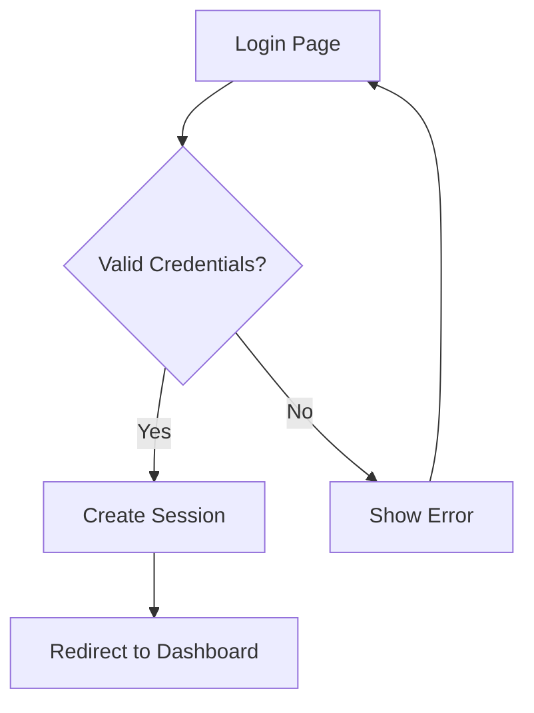

# Code to PRD Converter

This skill analyzes existing frontend and backend code to generate comprehensive PRD documents with SolarWire wireframes.

## Overview

**Core Capability**: Read and understand the entire codebase, then reverse engineer into structured PRD documents.

### What This Skill Does

1. **Frontend Analysis**
   - Parse HTML/JSX/Vue components
   - Extract UI structure and layouts
   - Identify user interactions and flows

2. **Backend Analysis**
   - Parse API endpoints and routes
   - Extract data models and schemas
   - Identify business logic and rules

3. **PRD Generation**
   - Generate complete PRD documents
   - Create SolarWire wireframes
   - Document all features and interactions

## When to Invoke

- User wants to "reverse engineer" code to PRD
- User asks to "generate PRD from existing code"
- User provides a codebase and wants documentation
- User wants to understand an existing project's requirements

---

## Incremental Analysis Support

**⚠️ IMPORTANT: Frontend and backend code are often maintained by different teams. This skill supports incremental analysis:**

### Scenario 1: Frontend Only

When only frontend code is provided:
- Generate UI wireframes and page structures
- Document user interactions and flows
- Infer API requirements from frontend calls
- Mark backend sections as `[To be confirmed]`

### Scenario 2: Backend Only

When only backend code is provided:
- Document API endpoints and data models
- Extract business logic and validation rules
- Infer UI requirements from API responses
- Mark frontend sections as `[To be confirmed]`

### Scenario 3: Full Stack

When both frontend and backend code are provided:
- Generate complete PRD with all sections
- Cross-reference frontend calls with backend endpoints
- Validate consistency between UI and API

### Merging Incremental PRDs

When a new codebase is provided for an existing PRD:

```
1. Check if `.solarwire/[requirement-name]/solarwire-prd.md` exists
2. Ask user: "Found existing PRD. Do you want to:
   - Merge new analysis into existing PRD
   - Create a new PRD version
   - Overwrite existing PRD"
3. Merge strategy:
   - Frontend analysis → Update Page Details section
   - Backend analysis → Update API Reference and Data Models sections
   - Mark resolved `[To be confirmed]` sections
```

---

## Workflow

### Phase 1: Codebase Discovery

**Goal: Understand the project structure**

```
1. Ask user for codebase location or files
2. Scan project structure:
   - Frontend directory (src/, pages/, components/)
   - Backend directory (api/, routes/, models/)
   - Configuration files (package.json, tsconfig.json)
3. Identify tech stack:
   - Frontend: React/Vue/Angular/HTML
   - Backend: Node.js/Python/Java/Go
   - Database: MySQL/MongoDB/PostgreSQL
```

### Phase 2: Frontend Analysis

**Goal: Extract UI structure and interactions**

#### 2.1 Component Structure

Analyze frontend code to identify:

| Analysis Target | What to Extract |
|-----------------|-----------------|
| Pages/Routes | All page components and their routes |
| Components | Reusable UI components |
| Layouts | Page layout patterns |
| Navigation | Menu, tabs, breadcrumbs |

#### 2.2 UI Elements

For each page/component, identify:

| Element Type | What to Extract |
|--------------|-----------------|
| Forms | Input fields, validation rules, submit actions |
| Buttons | Click handlers, disabled conditions |
| Tables | Columns, data source, actions |
| Modals | Trigger conditions, content, actions |
| Lists | Data source, item structure, interactions |

#### 2.3 Interactions

Extract interaction patterns:

```
- Event handlers (onClick, onChange, onSubmit)
- State changes (useState, Vuex, Redux)
- Navigation flows (router.push, href)
- API calls (fetch, axios, graphql)
```

### Phase 3: Backend Analysis

**Goal: Extract API and business logic**

#### 3.1 API Endpoints

Analyze backend routes to identify:

| Analysis Target | What to Extract |
|-----------------|-----------------|
| Routes | All API endpoints (method, path) |
| Parameters | Request params, body, query |
| Responses | Response structure, status codes |
| Authentication | Auth requirements, permissions |

#### 3.2 Data Models

Analyze database schemas/models:

| Analysis Target | What to Extract |
|-----------------|-----------------|
| Entities | All data entities/tables |
| Fields | Field names, types, constraints |
| Relations | Entity relationships |
| Validation | Field validation rules |

#### 3.3 Business Logic

Extract business rules from code:

```
- Validation rules
- Calculation formulas
- State transitions
- Permission checks
- Error handling
```

### Phase 4: PRD Generation

**Goal: Generate complete PRD document**

Follow the exact PRD structure from `solarwire-prd` skill:

```markdown
# Product Requirements Document - [Project Name]

## Document Information
| Project Name | [Project Name] |
|-------------|----------------|
| Version | v1.0 |
| Created Date | [Date] |
| Author | Generated from codebase |

---

## 1. Product Overview

### 1.1 Product Background
[Inferred from codebase structure and comments]

### 1.2 Target Users
[Inferred from authentication and user-related code]

### 1.3 Core Value
[Inferred from main features]

### 1.4 User Stories
[Generated from user interactions found in code]

---

## 2. Feature Scope

### 2.1 Feature List
[Generated from pages/components and API endpoints]

### 2.2 Feature Boundary
[Inferred from what is implemented vs not]

---

## 3. Business Flow

### 3.1 Core Business Flowchart
[Generated from user interaction flows]

### 3.2 Interaction Sequence Diagram
[Generated from frontend-backend interactions]

---

## 4. Page Design

### 4.1 Page List
[Generated from frontend routes/pages]

---

## 5. Page Details

[For each page, generate SolarWire wireframe with notes]

---

## 6. Non-functional Requirements

[Inferred from codebase patterns]

---

## 7. Appendix

### 7.1 API Reference
[Generated from backend routes]

### 7.2 Data Models
[Generated from database schemas]
```

---

## Output File Structure

**All requirements are organized under the `.solarwire` directory, each in its own folder:**

```
.solarwire/                              # Root directory for all PRD outputs
├── [requirement-name-1]/                # Folder for requirement 1
│   ├── solarwire-prd.md                 # PRD document (fixed name)
│   ├── [page-name]-with-notes.svg       # Wireframe with notes
│   ├── [page-name]-without-notes.svg    # Wireframe without notes
│   └── ...                              # More SVGs for this requirement
│
├── [requirement-name-2]/                # Folder for requirement 2
│   ├── solarwire-prd.md
│   └── ...
│
└── ...                                  # More requirement folders
```

---

## SVG Generation

After generating the PRD markdown file, run the SVG generation script:

```bash
node generate-svg.js .solarwire/[requirement-name]/solarwire-prd.md
```

**The script will:**
- Extract all `solarwire` code blocks from the markdown file
- Generate two SVG files for each block:
  - `[page-name]-with-notes.svg` - Includes note annotations
  - `[page-name]-without-notes.svg` - Clean wireframe only
- Save files to the same directory as the markdown file

---

## SolarWire Wireframe Specifications

**CRITICAL: Follow all SolarWire syntax rules from `solarwire-prd` skill**

### Core Syntax Rules

```
1. All elements must have coordinates @(x,y)
2. Write attributes directly without brackets: w=100 h=40 (not [w=100 h=40])
3. Text content MUST use double quotes: "Login" (not Login)
4. Attribute order: Content → Coordinates → Size → Other attributes → note
```

### Element Selection Principles

| Scenario | Recommended Element | Example |
|----------|---------------------|---------|
| Primary Buttons | Rectangle `[]` with background color | `["Login"] @(100,50) w=100 h=40 bg=#1890FF c=#FFFFFF` |
| Secondary Buttons | Rectangle `[]` with border | `["Cancel"] @(220,50) w=80 h=40 bg=#FFFFFF b=#F2F2F2` |
| Cards/Containers | Rounded Rectangle `()` | `("User Info Card") @(100,50) w=300 h=200` |
| Avatars | Circle with placeholder | `(("A")) @(100,50) w=40 bg=#F2F2F2 c=#AAAAAA` |
| Icon Buttons | Circle with icon text | `(("?")) @(100,50) w=32 h=32 bg=#F2F2F2` |
| Labels/Text | Plain Text `""` | `"Username" @(100,50)` |
| Input Fields | Rectangle with placeholder | `["Enter username..."] @(100,50) w=280 h=40 bg=#FFFFFF b=#F2F2F2 c=#AAAAAA` |
| Dividers | Line `--` | `-- @(0,100)->(400,100) b=#F2F2F2` |
| Data Tables | Table `##` | `## @(100,50) w=500 border=1` |

**Common Mistakes to Avoid:**
- ❌ `((Avatar))` - Text without double quotes
- ❌ `[Login]` - Text without double quotes
- ❌ Using placeholder `[?]` for buttons (use `["Button Text"]` instead)
- ❌ Using rectangle `[]` for plain labels (use `"Label"` instead)
- ❌ Overcrowding elements - use 10px spacing

### Element Mapping

| Frontend Code | SolarWire Element |
|---------------|-------------------|
| `<button>Submit</button>` | `["Submit"] @(x,y) w=100 h=40` |
| `<input type="text" placeholder="Enter...">` | `["Enter..."] @(x,y) w=200 h=40 c=#AAAAAA` |
| `<input type="password">` | `["••••••"] @(x,y) w=200 h=40` |
| `<input type="checkbox">` | `[☑ "Label"] @(x,y)` |
| `<input type="radio">` | `[○ "Label"] @(x,y)` |
| `<select>` | `[▼ "Selected"] @(x,y) w=200 h=40` |
| `<textarea>` | `["Multi-line text..."] @(x,y) w=300 h=100` |
| `<h1>Title</h1>` | `"Title" @(x,y) size=24 bold` |
| `<p>Text</p>` | `"Text" @(x,y)` |
| `<a href="...">Link</a>` | `"Link" @(x,y) c=#1890FF` |
| `` | `[🖼 "Logo"] @(x,y) w=100 h=100` |
| `<table>` | `## @(x,y) w=500 border=1` |
| `<hr>` | `-- @(x1,y1)->(x2,y2) b=#F2F2F2` |
| `<div class="card">` | `("Card Title") @(x,y) w=300 h=200` |
| Timeline/Stepper | Convert to table or list (see below) |
| Progress bar | Show as text with percentage `"Progress: 60%"` |

---

## Mock Data Generation

**⚠️ CRITICAL: Always generate realistic mock data, never leave fields empty**

### Why Mock Data Matters

Frontend code often:
- Uses components that display data
- Shows loading states while waiting for backend
- Displays lists/tables with dynamic data

**When reverse engineering, generate mock data that represents:**
- Typical data patterns
- Edge cases (long text, special characters)
- Empty states with meaningful placeholders

### Mock Data Rules

| Element Type | Mock Data Strategy |
|--------------|-------------------|
| **User names** | Use realistic names: "John Doe", "张三", "田中太郎" |
| **Emails** | Use realistic emails: "john@example.com" |
| **Dates** | Use realistic dates: "2024-01-15", "2024-01-15 14:30" |
| **Status** | Use meaningful values: "Active", "正常", "有効" |
| **Numbers** | Use realistic values: "¥1,234.00", "100 items" |
| **IDs** | Use realistic IDs: "USR-001", "202401150001" |
| **Descriptions** | Use meaningful text: "This is a sample description..." |
| **Empty states** | Use meaningful placeholders: "No data", "暂无数据" |

### Table Mock Data Example

**❌ Bad (Empty/Placeholder):**
```solarwire
## @(100,50) w=500 border=1
  # bg=#F2F2F2
    "ID"
    "Name"
    "Status"
  #
    ""
    ""
    ""
```

**✅ Good (Realistic Mock Data):**
```solarwire
## @(100,50) w=500 border=1 note="User list table
1. Data source
   - User list data from User Management module
2. Field descriptions
   - ID: Unique user identifier
   - Name: User display name
   - Status: 1=Active, 0=Disabled"
  # bg=#F2F2F2 bold
    "ID"
    "Name"
    "Status"
  # bg=#FAFAFA
    "USR-001"
    "John Doe"
    "Active"
  #
    "USR-002"
    "张三"
    "Active"
  # bg=#FAFAFA
    "USR-003"
    "田中太郎"
    "Disabled"
```

### Form Mock Data Example

**❌ Bad (Empty):**
```solarwire
[""] @(100,50) w=200 h=40
```

**✅ Good (With Placeholder):**
```solarwire
["Enter your email..."] @(100,50) w=200 h=40 c=#AAAAAA
```

---

## Complex UI Pattern Conversion

### Timeline/Stepper → List (Preferred)

**Frontend Timeline/Stepper code:**
```jsx
<Steps current={1}>
  <Step title="Submitted" description="2024-01-15 10:00" />
  <Step title="Under Review" description="2024-01-15 14:30" />
  <Step title="Approved" description="Pending" />
</Steps>
```

**Convert to Table:**
```solarwire
## @(100,50) w=400 border=1 note="Approval timeline
1. Data source
   - Approval history from Workflow module
2. Field descriptions
   - Step: Approval stage name
   - Status: Current status
   - Time: Action timestamp"
  # bg=#F2F2F2 bold
    "Step"
    "Status"
    "Time"
  # bg=#E6F7FF
    "Submitted"
    "✓ Completed"
    "2024-01-15 10:00"
  # bg=#E6F7FF
    "Under Review"
    "● In Progress"
    "2024-01-15 14:30"
  #
    "Approved"
    "○ Pending"
    "-"
```

**Or Convert to List:**
```solarwire
"Approval Timeline" @(100,50) bold

"1. Submitted" @(100,80)
"   ✓ Completed - 2024-01-15 10:00" @(100,100) c=#52C41A

"2. Under Review" @(100,130)
"   ● In Progress - 2024-01-15 14:30" @(100,150) c=#1890FF

"3. Approved" @(100,180)
"   ○ Pending" @(100,200) c=#AAAAAA
```

### Progress Bar → Text with Percentage

**Frontend Progress Bar:**
```jsx
<Progress percent={60} />
```

**Convert to Text:**
```solarwire
"Upload Progress: 60%" @(100,50)
["████████████░░░░░░░░"] @(100,70) w=200 h=10 bg=#1890FF
```

### Loading State → Placeholder with Note

**Frontend Loading:**
```jsx
{isLoading ? <Skeleton /> : <DataList data={data} />}
```

**Convert to Placeholder with Note:**
```solarwire
["Loading data..."] @(100,50) w=200 h=40 c=#AAAAAA note="Loading state
1. Display condition
   - Show while fetching data from backend
2. Behavior
   - Auto-hide when data loaded
   - Show actual data list on success"
```

### Component Reference → Note with Description

**Frontend Component:**
```jsx
<UserCard user={selectedUser} />
```

**Convert to Card with Note:**
```solarwire
("User Card") @(100,50) w=300 h=150 note="User information card
1. Data source
   - Selected user data from User Management module
2. Display fields
   - Avatar: User profile image
   - Name: User display name
   - Email: User email address
   - Department: User department name"
```

---

## Complex Table Recognition

### UI Component Library Tables

| Library | Table Detection Pattern |
|---------|----------------------|
| Ant Design | `<Table columns={columns} dataSource={data} />` |
| Element UI | `<el-table :data="tableData">` |
| AG Grid | `<ag-grid :rowData="gridData">` |
| Material UI | `<el-table :data="tableData">` |

### Detection Rules

```javascript
// Detect table by tag
if (tagName === 'TABLE' || tagName === 'EL-TABLE' || tagName === 'AG-GRID') {
  return 'table';
}

// Detect by class names
if (className.includes('table') || className.includes('grid') || className.includes('list')) {
  return 'table';
}

// Detect by data-* attributes
if (attributes['data-source'] || attributes['data'] || attributes['row-data']) {
  return 'table';
}
```

---

## Frontend-Backend Data Mapping

When analyzing frontend code, infer backend data requirements:

| Frontend Pattern | Backend Requirement | Mock Data |
|------------------|---------------------|-----------|
| `{user.name}` | User API - name field | "John Doe" |
| `{items.map(...)}` | List API - array response | Generate 3-5 items |
| `{data.total}` | Pagination API - total count | "100" |
| `{item.status === 'active'}` | Status field with enum | "active", "inactive" |
| `{new Date(item.created)}` | Date field | "2024-01-15" |

---

## Incremental Analysis Support

When analyzing code, infer reasonable positions:

```
1. Container Size
   - Mobile: w=375 h=812
   - Web: w=1440 h=900
   - Admin: w=1920 h=1080

2. Element Spacing
   - Vertical: 10px between elements
   - Horizontal: 10px between related elements
   - Form groups: 50-60px vertical spacing

3. Element Sizes
   - Buttons: h=40-48px, w=80-300px
   - Inputs: h=40-44px, w=200-400px
   - Labels: h=22px (line height)
   - Tables: row h=40-48px

4. Colors
   - Primary: #1890FF
   - Error: #D9001B
   - Success: #52C41A
   - Warning: #FAAD14
   - Text: #333333
   - Secondary: #AAAAAA
   - Border: #F2F2F2
   - Background: #FFFFFF
```

### Note Generation Rules

**Core Principle: notes describe functional behavior and business logic, not visual details or technical implementation**

---

#### 1. When to Write Notes

**Write notes for:**
- Interactive elements (buttons, links, etc.)
- Input elements with validation or logic
- Dropdowns (selection behavior, options source)
- Data display elements with complex rules (tables, lists)
- Elements with business logic (calculations, conditions)
- Complex concepts requiring additional explanation

**Skip notes for:**
- Pure visual elements (dividers, containers, decorative icons)
- Static labels and titles

**Common Sense Exemption (no note needed unless special behavior):**
- Back button (standard behavior: return to previous page)
- Close button
- Page selector
- Number stepper/incrementer

---

#### 2. Note Structure Format

**Format Rules:**
```
First line: Element definition (what this element is, NOT element type)
First level: Numbered (1. 2. 3.)
Second level: - or # (if third level exists)
Third level: -- or -
```

**Example:**
```solarwire
["Enter password"] @(100,100) w=280 h=40 note="Password input
1. Input rules
   - Password displayed as dots
   - Minimum 6 characters, maximum 32 characters
   - Must contain both letters and numbers
2. Interaction
   - Show/hide toggle icon on the right
   - Validate format on blur
   - Display error on format failure: 'Invalid password format'
3. Special notes
   - Lock account for 15 minutes after 5 consecutive errors"
```

---

#### 3. First Line: Element Definition

**The first line of a note MUST define what this element is (functional description, NOT element type).**

| Correct | Incorrect |
|---------|-----------|
| `Password input` | `[Password Field]` |
| `Username input` | `[Input Field]` |
| `User data table` | `[Data Table]` |
| `Submit form button` | `[Primary Button]` |

---

#### 4. Content Requirements by Element Type

**Interactive/Operational Elements:**

Must include:
- What happens on click/operation
- Success/failure handling
- Disabled conditions
- Special handling (debounce, throttle, etc.)

**Elements with Logic:**

Must include:
- Show/hide conditions
- Calculation rules
- Validation rules
- State transitions

**Data Display Elements:**

Must include:
- **Data source**: Module, page, or operation (NOT API/technical details); include formula if calculated
- **Display fields and rules**: Field meanings, formats, special handling
- **Sorting rules**: Default sort, sortable fields

---

#### 5. Content Forbidden in Notes

**NEVER include:**

| Forbidden | Example (Don't Write) |
|-----------|----------------------|
| Colors | "Button is blue", "Text color #333" |
| Fonts | "Font size 14px", "Bold text" |
| Sizes | "Width 100px", "Height 40px" |
| Spacing | "Margin 16px", "Padding 8px" |
| Border | "Border radius 8px" |
| Shadows | "Box shadow 0 2px 4px" |
| Animations | "Fade in 0.3s" |
| Technical details | "API: /api/login", "Database: user_id" |

**Why?** These are:
- Already shown visually in wireframe
- Design decisions to be made later
- Subject to change during implementation

---

#### 6. Generate Notes from Code Analysis

| Code Pattern | Note Content |
|--------------|--------------|
| `onClick={handleSubmit}` | "Click action - Submit form data" |
| `required` attribute | "Validation - Required field" |
| `disabled={condition}` | "Disabled conditions - [condition]" |
| `onChange={handleChange}` | "Interaction - Update state on change" |
| `errorMessage` state | "Error handling - Display: [message]" |
| API call in handler | "API - Call [endpoint] on [action]" |

---

## Multi-language (i18n) Support

**⚠️ CRITICAL: Only add i18n when user explicitly confirms multi-language support is needed**

When i18n is confirmed, use this format:

```markdown
**Page Name:** `Login`

**i18n:**
- `login.title`: "Welcome Back"
- `login.email`: "Email"
- `login.password`: "Password"
- `login.remember`: "Remember me"
- `login.submit`: "Sign In"
```

In wireframe, use i18n keys:

```solarwire
"{login.title}" @(600,200) size=24 bold
"{login.email}" @(520,320)
["{login.email.placeholder}"] @(520,345) w=400 h=44
```

---

## Dependencies

This skill requires the `lib` directory with bundled dependencies for SVG generation. Copy from `solarwire-prd` skill:

```bash
# Copy lib directory
cp -r .trae/skills/solarwire-prd/lib packages/ai/skill/solarwire-code-to-prd/lib
```

---

## Example: Full Codebase Analysis

### Input: Project Structure

```
my-app/
├── frontend/
│   ├── src/
│   │   ├── pages/
│   │   │   ├── Login.tsx
│   │   │   ├── Dashboard.tsx
│   │   │   └── Users.tsx
│   │   ├── components/
│   │   │   ├── Header.tsx
│   │   │   └── Table.tsx
│   │   └── api/
│   │       └── auth.ts
├── backend/
│   ├── routes/
│   │   ├── auth.ts
│   │   └── users.ts
│   ├── models/
│   │   ├── User.ts
│   │   └── Session.ts
│   └── middleware/
│       └── auth.ts
└── package.json
```

### Analysis Steps

1. **Read Login.tsx** → Extract login form structure, validation, API calls
2. **Read Dashboard.tsx** → Extract dashboard layout, widgets, data sources
3. **Read Users.tsx** → Extract user list table, actions, filters
4. **Read auth.ts (frontend)** → Extract API client methods
5. **Read auth.ts (backend)** → Extract authentication endpoints
6. **Read users.ts** → Extract user management endpoints
7. **Read User.ts** → Extract user data model
8. **Read Session.ts** → Extract session data model

### Output: Generated PRD

```markdown
# User Management System - Product Requirements Document

## Document Information
| Project Name | User Management System |
|-------------|------------------------|
| Version | v1.0 |
| Created Date | 2024-01-15 |
| Author | Generated from codebase |

---

## 1. Product Overview

### 1.1 Product Background
A web-based user management system with authentication and user administration capabilities.

### 1.2 Target Users
- Administrators: Full access to user management
- Regular Users: Access to personal profile

### 1.3 Core Value
Secure user authentication and efficient user administration.

### 1.4 User Stories

| ID | User Story | Acceptance Criteria | Priority |
|----|------------|---------------------|----------|
| US-001 | As a user, I want to log in, so that I can access the system | - Given valid credentials, when I submit, then I'm redirected to dashboard | P0 |
| US-002 | As an admin, I want to view users, so that I can manage them | - Given I'm logged in as admin, when I visit users page, then I see user list | P0 |

---

## 2. Feature Scope

### 2.1 Feature List
| Module | Feature | Priority | Description |
|--------|---------|----------|-------------|
| Authentication | Login | P0 | User authentication with email/password |
| Authentication | Session | P0 | Session management with remember me |
| User Management | User List | P0 | View and search users |
| User Management | User Actions | P1 | Edit, delete users |

---

## 3. Business Flow

### 3.1 Authentication Flow


---

## 4. Page Design

### 4.1 Page List
| Page Name | Page Type | Description |
|-----------|-----------|-------------|
| Login | Main Page | User authentication |
| Dashboard | Main Page | System overview |
| Users | Main Page | User management |

---

## 5. Page Details

### 5.1 Login Page

**Page Overview**: User authentication page with email/password login

```solarwire
!title="Login"
!c=#333333
!size=13
!bg=#F2F2F2

[] @(0,0) w=1440 h=900 bg=#FFFFFF

"Welcome Back" @(600,200) size=24 bold
"Please sign in to continue" @(580,235) c=#AAAAAA

"Email" @(520,320)
["Enter your email"] @(520,345) w=400 h=44 bg=#FFFFFF b=#F2F2F2 c=#AAAAAA note="Email input
1. Input rules
   - Valid email format required
   - Max length: 100 characters
2. Validation
   - Error: 'Please enter a valid email'"

"Password" @(520,420)
["Enter password"] @(520,445) w=400 h=44 bg=#FFFFFF b=#F2F2F2 c=#AAAAAA note="Password input
1. Input rules
   - Min 6 characters
   - Displayed as dots
2. Interaction
   - Show/hide toggle on right"

[☑ "Remember me"] @(520,520) note="Remember me checkbox
1. Behavior
   - Checked: Session valid for 7 days
   - Unchecked: Session expires on browser close"

["Sign In"] @(520,590) w=400 h=48 bg=#1890FF c=#FFFFFF size=16 note="Sign in button
1. Click action
   - Validate email and password
   - Call POST /api/auth/login
2. Success handling
   - Store session token
   - Redirect to dashboard
3. Failure handling
   - Display: 'Invalid credentials'
   - Clear password field
4. Disabled conditions
   - Disabled when email or password is empty"
```

---

## 6. Non-functional Requirements

### 6.1 Performance Requirements
- Page load time: < 2 seconds
- API response time: < 500ms

### 6.2 Security Requirements
- Password hashing: bcrypt
- Session: JWT with 7-day expiry
- HTTPS required

---

## 7. Appendix

### 7.1 API Reference

| Method | Endpoint | Description | Auth |
|--------|----------|-------------|------|
| POST | /api/auth/login | User login | No |
| POST | /api/auth/logout | User logout | Yes |
| GET | /api/users | Get user list | Admin |
| GET | /api/users/:id | Get user detail | Admin |
| PUT | /api/users/:id | Update user | Admin |
| DELETE | /api/users/:id | Delete user | Admin |

### 7.2 Data Models

**User Model:**
| Field | Type | Required | Description |
|-------|------|----------|-------------|
| id | string | Yes | Unique identifier |
| email | string | Yes | User email |
| password | string | Yes | Hashed password |
| name | string | No | Display name |
| role | enum | Yes | 'admin' or 'user' |
| createdAt | datetime | Yes | Creation time |

**Session Model:**
| Field | Type | Required | Description |
|-------|------|----------|-------------|
| id | string | Yes | Session ID |
| userId | string | Yes | User reference |
| token | string | Yes | JWT token |
| expiresAt | datetime | Yes | Expiry time |
```

---

## Important Reminders

1. **Read All Code** - Analyze entire codebase, not just entry files
2. **Understand Context** - Infer business meaning from code patterns
3. **Follow SolarWire Syntax** - All elements must have coordinates, text in quotes
4. **Generate Complete PRD** - Include all sections from solarwire-prd skill
5. **Document APIs** - Extract all endpoints from backend routes
6. **Document Data Models** - Extract all schemas from database models
7. **Infer Business Logic** - Extract rules from validation and processing code
8. **Generate Wireframes** - Create SolarWire for every page/component
9. **Add Notes** - Document functionality from code analysis
10. **Output to .solarwire** - Save PRD to `.solarwire/[project-name]/solarwire-prd.md`
