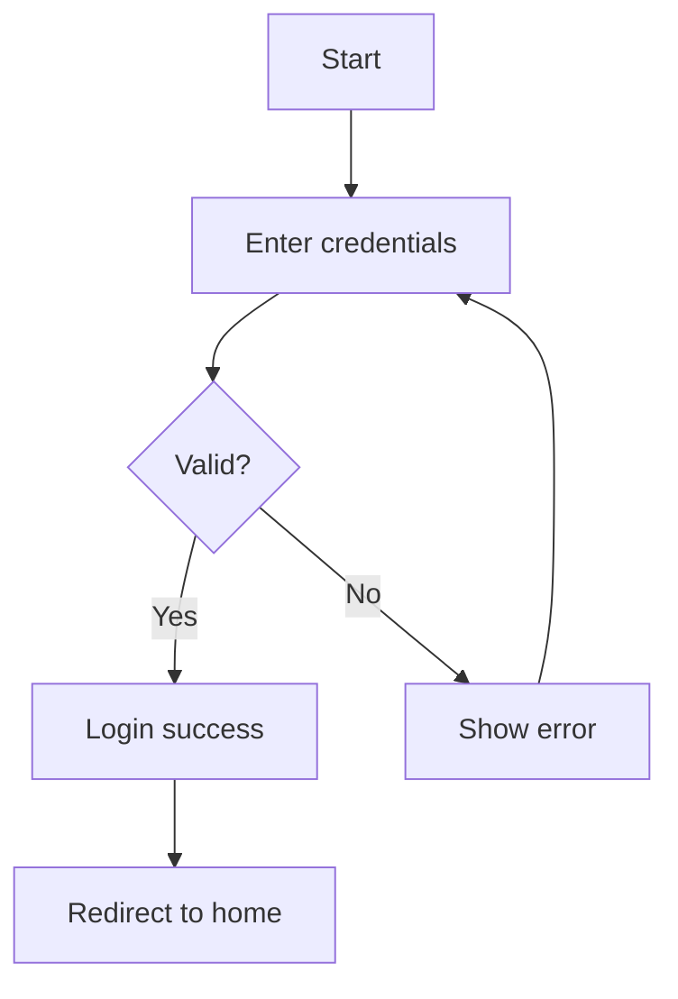
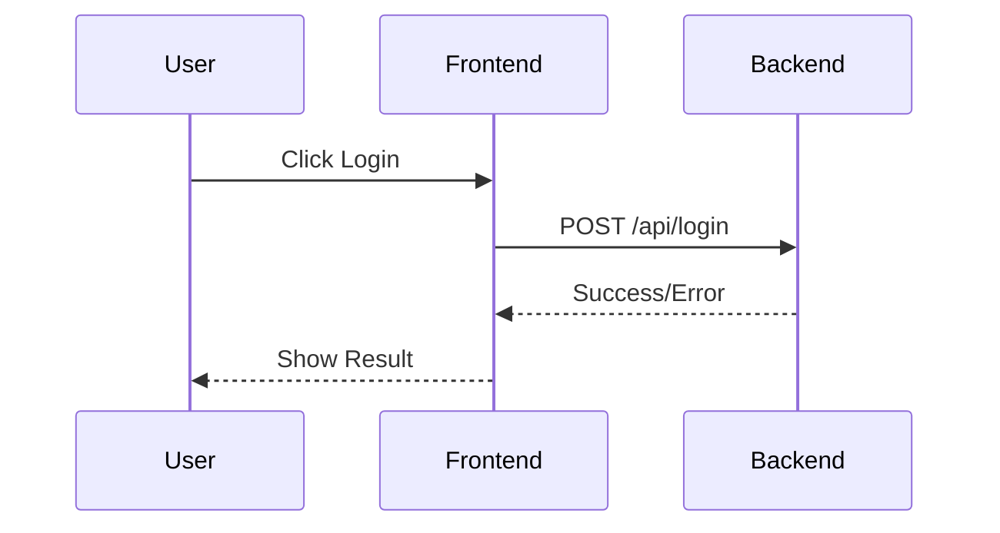

# SolarWire PRD to Test Case Generator

## Configuration

- **Input**: `.solarwire/[requirement-name]/solarwire-prd.md`
- **Output**: `.solarwire/[requirement-name]/test-cases.xlsx`

---

## Overview

This skill guides AI to read and understand SolarWire PRD documents, then generate comprehensive test case documentation.

**Focus**: Black-box functional testing only (no performance, security, or automated script testing)

---

## How to Read PRD Document

### PRD Document Structure

A SolarWire PRD document contains the following sections:

```markdown
# Product Requirements Document - [Project Name]

## Document Information
## 1. Product Overview
## 2. Feature Scope
## 3. Business Flow
## 4. Page Design
## 5. Page Details (with SolarWire wireframes)
## 6. Non-functional Requirements
## 7. Appendix
```

### Reading Order for Test Case Generation

1. **Document Information** → Get project context
2. **User Stories (1.4)** → Extract acceptance criteria
3. **Feature List (2.1)** → Get feature coverage
4. **Business Flows (3.x)** → Extract flow test scenarios
5. **Page Details (5.x)** → Extract UI test cases from SolarWire notes

---

## Section 1: Reading User Stories

### User Story Format

```markdown
| ID | User Story | Acceptance Criteria | Priority |
|----|------------|---------------------|----------|
| US-001 | As a [role], I want to [action], so that [benefit] | - Given [context], when [action], then [result] | P0 |
```

### How to Extract Test Cases

Each user story with Given-When-Then format generates acceptance test cases:

| Source | Test Case Type | How to Generate |
|--------|---------------|-----------------|
| Given | Precondition | Use as test precondition |
| When | Test Steps | Use as test action |
| Then | Expected Result | Use as expected outcome |
| Priority | Priority | Inherit from user story |

### Example

**User Story:**
```
| US-001 | As a user, I want to login, so that I can access my account |
  - Given user is on login page, when entering valid credentials, then login succeeds
  - Given user is on login page, when entering invalid credentials, then error shows
```

**Generated Test Cases:**

| ID | Module | Name | Type | Precondition | Steps | Expected | Priority |
|----|--------|------|------|--------------|-------|----------|----------|
| TC-001 | 用户故事验收 | US-001-登录成功 | 功能测试 | 用户在登录页面 | 1. 用户在登录页面<br>2. 输入有效凭证 | 登录成功 | P0 |
| TC-002 | 用户故事验收 | US-001-登录失败 | 功能测试 | 用户在登录页面 | 1. 用户在登录页面<br>2. 输入无效凭证 | 显示错误提示 | P0 |

---

## Section 2: Reading Feature List

### Feature List Format

```markdown
| Module | Feature | Priority | Description |
|--------|---------|----------|-------------|
| 用户管理 | 用户登录 | P0 | 支持用户登录功能 |
```

### How to Extract Test Cases

Each feature generates a feature coverage test case:

| Field | Test Case Field |
|-------|----------------|
| Module | 所属模块 |
| Feature | 用例名称 (功能验证) |
| Priority | 优先级 |
| Description | 预期结果 |

---

## Section 3: Reading Business Flows

### Mermaid Flowchart Format



### How to Extract Test Cases

1. **Identify all paths** through the flowchart
2. **Each path** generates a flow test case
3. **Decision nodes** (diamond shape) create branch scenarios

### Path Analysis

| Path | Test Scenario | Steps |
|------|--------------|-------|
| Happy Path | A→B→C(Yes)→D→F | 正常登录流程 |
| Error Path | A→B→C(No)→E→B | 登录失败重试 |

### Sequence Diagram Format



### How to Extract Test Cases

Each interaction sequence generates an API/Integration test case:

| Interaction | Test Case |
|-------------|-----------|
| U->>F | UI interaction test |
| F->>B | API request test |
| B-->>F | Response handling test |
| F-->>U | Display result test |

---

## Section 4: Reading SolarWire Wireframes (MOST IMPORTANT)

### SolarWire Code Block Structure

```solarwire
!title="Page Name"
!c=#333333
!size=13
!bg=#F2F2F2

// Container
[] @(0,0) w=1440 h=900 bg=#FFFFFF

// Elements with notes
["Login"] @(100,50) w=100 h=40 bg=#1890FF c=#FFFFFF note="Login button
1. Click action
   - Validate username and password
2. Success handling
   - Save login state
   - Redirect to homepage
3. Failure handling
   - Display error: 'Invalid credentials'
4. Disabled conditions
   - Disabled when username or password is empty"
```

### How to Read Page Title

```
!title="Page Name"  →  Module name for test cases
```

### How to Read Element Types

| SolarWire Syntax | Element Type | Test Focus |
|-----------------|--------------|------------|
| `["text"]` | Rectangle/Button | Click actions, state changes |
| `"text"` | Plain Text | Data display verification |
| `(("text"))` | Circle/Avatar | Image display, placeholder |
| `("text")` | Rounded Rectangle | Card/Container content |
| `[?"text"]` | Icon Placeholder | Icon functionality |
| `-- @(x,y)->(x,y)` | Line/Divider | Visual separation (usually no test) |
| `##` | Table | Data display, sorting, pagination |

### How to Read Element Position and Size

```
@(x,y)  →  Position (top-left anchor)
w=100   →  Width
h=40    →  Height
```

**Note:** Position and size are for visual layout, NOT for test case content.

---

## Section 5: Reading Notes (KEY FOR TEST CASES)

### Note Structure

```
note="[Element Definition]
1. [Section Name]
   - [Item 1]
   - [Item 2]
2. [Section Name]
   - [Item 1]
   - [Item 2]"
```

### First Line: Element Definition

The first line defines what this element IS (functional description):

```
note="Login button        ← Element definition
1. Click action..."
```

**Use this as the test case name prefix.**

---

### Note Sections and Test Case Mapping

#### Section: Click action / 点击

**Test Type:** 功能测试 (Functional Test)

**How to Generate:**
- Each bullet item → One test case
- Test steps: Include the click action
- Expected: The action result described

**Example Note:**
```
1. Click action
   - Validate username and password
   - Submit login request
```

**Generated Test Cases:**

| Name | Type | Steps | Expected | Priority |
|------|------|-------|----------|----------|
| Login button-点击操作 | 功能测试 | 1. 查看Login button<br>2. 点击按钮 | 验证用户名和密码 | P0 |
| Login button-提交请求 | 功能测试 | 1. 查看Login button<br>2. 点击按钮 | 提交登录请求 | P0 |

---

#### Section: Success handling / 成功

**Test Type:** 功能测试 (Functional Test)

**How to Generate:**
- Each bullet item → Expected behavior after success
- Precondition: Action completed successfully

**Example Note:**
```
2. Success handling
   - Save login state
   - Redirect to homepage
```

**Generated Test Cases:**

| Name | Type | Precondition | Expected | Priority |
|------|------|--------------|----------|----------|
| Login button-成功处理-保存状态 | 功能测试 | 登录成功 | 保存登录状态 | P0 |
| Login button-成功处理-跳转首页 | 功能测试 | 登录成功 | 跳转到首页 | P0 |

---

#### Section: Failure handling / 失败 / Error

**Test Type:** 异常测试 (Exception Test)

**How to Generate:**
- Each bullet item → One exception test case
- Test steps: Trigger the failure condition
- Expected: The error handling described

**Example Note:**
```
3. Failure handling
   - Display error: 'Invalid credentials'
   - Clear password field
```

**Generated Test Cases:**

| Name | Type | Steps | Expected | Priority |
|------|------|-------|----------|----------|
| Login button-异常处理-错误提示 | 异常测试 | 1. 输入无效凭证<br>2. 点击登录 | 显示错误提示 | P1 |
| Login button-异常处理-清空密码 | 异常测试 | 1. 输入无效凭证<br>2. 点击登录 | 清空密码字段 | P1 |

---

#### Section: Input rules / 输入

**Test Type:** 表单验证 + 边界测试 (Form Validation + Boundary Test)

**How to Generate:**
1. Extract length constraints → Generate boundary tests
2. Extract format rules → Generate format validation tests
3. Extract character rules → Generate character validation tests

**Example Note:**
```
1. Input rules
   - Minimum 6 characters, maximum 32 characters
   - Must contain both letters and numbers
   - Password displayed as dots
```

**Generated Test Cases:**

| Name | Type | Test Data | Expected | Priority |
|------|------|-----------|----------|----------|
| Password input-最小长度边界 | 边界测试 | 5字符 | 提示长度不足 | P1 |
| Password input-最小长度有效 | 边界测试 | 6字符 | 通过验证 | P1 |
| Password input-最大长度有效 | 边界测试 | 32字符 | 通过验证 | P1 |
| Password input-最大长度边界 | 边界测试 | 33字符 | 提示长度超限 | P1 |
| Password input-格式验证-纯数字 | 表单验证 | 123456 | 提示必须包含字母 | P0 |
| Password input-格式验证-纯字母 | 表单验证 | abcdef | 提示必须包含数字 | P0 |
| Password input-显示方式 | UI测试 | 输入密码 | 显示为圆点 | P2 |

---

#### Section: Validation / 校验 / 验证

**Test Type:** 表单验证 (Form Validation)

**How to Generate:**
- Each validation rule → One or more test cases
- Include valid and invalid formats

**Example Note:**
```
2. Validation
   - Format: 11-digit phone number or email format
   - Error message: 'Please enter a valid phone number or email'
```

**Generated Test Cases:**

| Name | Type | Test Data | Expected | Priority |
|------|------|-----------|----------|----------|
| Username input-格式校验-手机号 | 表单验证 | 13812345678 | 通过验证 | P0 |
| Username input-格式校验-邮箱 | 表单验证 | test@example.com | 通过验证 | P0 |
| Username input-格式校验-无效格式 | 表单验证 | abc123 | 显示错误提示 | P0 |

---

#### Section: Disabled conditions / 禁用 / 不可

**Test Type:** UI测试 (UI Test)

**How to Generate:**
- Each condition → One UI state test case
- Verify element is disabled when condition is met

**Example Note:**
```
4. Disabled conditions
   - Disabled when username or password is empty
```

**Generated Test Cases:**

| Name | Type | Precondition | Expected | Priority |
|------|------|--------------|----------|----------|
| Login button-禁用状态-用户名为空 | UI测试 | 用户名为空 | 按钮禁用 | P1 |
| Login button-禁用状态-密码为空 | UI测试 | 密码为空 | 按钮禁用 | P1 |

---

#### Section: Visibility conditions / 显示条件

**Test Type:** UI测试 (UI Test)

**How to Generate:**
- Each condition → One visibility test case
- Verify element shows/hides based on condition

**Example Note:**
```
1. Visibility conditions
   - Show when ≥ 1 items selected
   - Hide when no items selected
```

**Generated Test Cases:**

| Name | Type | Precondition | Expected | Priority |
|------|------|--------------|----------|----------|
| Batch Delete-显示条件-选中项目 | UI测试 | 选中≥1个项目 | 按钮显示 | P1 |
| Batch Delete-显示条件-未选中项目 | UI测试 | 未选中任何项目 | 按钮隐藏 | P1 |

---

#### Section: Data source / 数据

**Test Type:** 功能测试 (Functional Test)

**How to Generate:**
- Verify data comes from correct source
- Verify data display rules

**Example Note:**
```
1. Data source
   - User list data from User Management module
   - Default sort: creation time descending
2. Field descriptions
   - ID: Unique user identifier
   - Status: 1='Active', 0='Disabled'
```

**Generated Test Cases:**

| Name | Type | Steps | Expected | Priority |
|------|------|-------|----------|----------|
| User list table-数据来源 | 功能测试 | 查看用户列表 | 数据来自用户管理模块 | P1 |
| User list table-默认排序 | 功能测试 | 查看用户列表 | 按创建时间降序排列 | P1 |
| User list table-字段显示-ID | 功能测试 | 查看ID列 | 显示唯一用户标识 | P2 |
| User list table-字段显示-状态 | 功能测试 | 查看状态列 | 1显示Active, 0显示Disabled | P1 |

---

#### Section: Options / 选项

**Test Type:** 功能测试 (Functional Test)

**How to Generate:**
- Verify all options are available
- Verify default selection
- Verify selection behavior

**Example Note:**
```
1. Options (i18n: English/中文/日本語)
   - All [All/全部/すべて]
   - Active [Active/正常/有効]
   - Disabled [Disabled/禁用/無効]
2. Default: All
```

**Generated Test Cases:**

| Name | Type | Steps | Expected | Priority |
|------|------|-------|----------|----------|
| Status dropdown-选项列表 | 功能测试 | 展开下拉框 | 显示All/Active/Disabled选项 | P0 |
| Status dropdown-默认值 | 功能测试 | 查看下拉框 | 默认选中All | P1 |
| Status dropdown-选项选择 | 功能测试 | 选择Active选项 | 选中Active | P0 |

---

#### Section: Tooltip / 提示

**Test Type:** UI测试 (UI Test)

**How to Generate:**
- Verify tooltip shows on hover/focus
- Verify tooltip content

**Example Note:**
```
1. Tooltip content
   - Hover to show: 'Supports phone number or email login'
```

**Generated Test Cases:**

| Name | Type | Steps | Expected | Priority |
|------|------|-------|----------|----------|
| Help icon-提示内容 | UI测试 | 悬停图标 | 显示提示信息 | P2 |

---

#### Section: i18n / 多语言

**Test Type:** 国际化测试 (i18n Test)

**How to Generate:**
- Verify text displays correctly in each language
- One test case per language

**Example Note:**
```
2. i18n: English=Login, 中文=登录, 日本語=ログイン
```

**Generated Test Cases:**

| Name | Type | Steps | Expected | Priority |
|------|------|-------|----------|----------|
| Login button-多语言-英文 | 国际化测试 | 切换到英文 | 显示Login | P2 |
| Login button-多语言-中文 | 国际化测试 | 切换到中文 | 显示登录 | P2 |
| Login button-多语言-日文 | 国际化测试 | 切换到日文 | 显示ログイン | P2 |

---

## Section 6: Reading Table Elements

### Table Syntax

```solarwire
## @(100,50) w=500 border=1 note="User list table
1. Data source
   - User list data from User Management module
2. Field descriptions
   - ID: Unique user identifier
   - Name: User display name
   - Status: 1=Active, 0=Disabled
3. Sorting rules
   - Support sorting by name and created time"
  # bg=#F2F2F2
    "ID"
    "Name"
    "Status"
  # bg=#FAFAFA
    "1"
    "John Doe"
    "Active"
```

### How to Extract Test Cases from Tables

1. **Read table note** for data source and field descriptions
2. **Read header row** for column names
3. **Read data rows** for sample data

**Generated Test Cases:**

| Name | Type | Expected |
|------|------|----------|
| User list table-数据加载 | 功能测试 | 数据正确加载 |
| User list table-列显示-ID | 功能测试 | ID列显示唯一标识 |
| User list table-列显示-Name | 功能测试 | Name列显示用户名 |
| User list table-列显示-Status | 功能测试 | Status列显示状态 |
| User list table-排序功能 | 功能测试 | 支持按名称和时间排序 |
| User list table-分页功能 | 功能测试 | 分页正常工作 |

---

## Test Case Output Format

### Excel Structure

Generate an Excel file with the following sheets:

#### Sheet 1: 测试用例汇总

| Column | Width | Description |
|--------|-------|-------------|
| 用例编号 | 10 | TC-XXX format |
| 所属模块 | 15 | Page/Module name |
| 用例名称 | 30 | Brief test scenario |
| 测试类型 | 12 | 功能测试/UI测试/边界测试/异常测试 |
| 前置条件 | 25 | Prerequisites |
| 测试步骤 | 40 | Numbered steps |
| 测试数据 | 20 | Input data |
| 预期结果 | 30 | Expected outcome |
| 优先级 | 8 | P0/P1/P2 |
| 关联需求 | 10 | User story ID |
| 边界值 | 20 | Boundary test data |
| 异常场景 | 20 | Exception scenarios |
| 备注 | 20 | Additional notes |

#### Sheet 2: 按模块分组

Group test cases by module (page name from `!title`).

#### Sheet 3: 测试统计

- Total test cases
- By priority (P0/P1/P2)
- By test type
- By module

---

## Priority Rules

### Inherited Priority

| Source | Test Case Priority |
|--------|-------------------|
| User Story P0 | P0 |
| User Story P1 | P1 |
| User Story P2 | P2 |
| Feature P0 | P0 |
| Feature P1 | P1 |

### Default Priority by Test Type

| Test Type | Default Priority |
|-----------|-----------------|
| 功能测试 - 核心流程 | P0 |
| 功能测试 - 辅助功能 | P1 |
| 表单验证 | P0 |
| 边界测试 | P1 |
| 异常测试 | P1 |
| UI测试 | P2 |
| 国际化测试 | P2 |

---

## Test Case Naming Convention

### Format

```
[元素定义]-[测试场景]-[具体条件]
```

### Examples

| Test Case Name | Description |
|----------------|-------------|
| Login button-点击操作 | 点击登录按钮 |
| Login button-成功处理-跳转首页 | 登录成功后跳转 |
| Password input-最小长度边界 | 密码最小长度测试 |
| User list table-数据加载 | 表格数据加载 |
| Status dropdown-选项选择 | 下拉选项选择 |

---

## Workflow

### Step 1: Read PRD File

```
Read the PRD file at: .solarwire/[requirement-name]/solarwire-prd.md
```

### Step 2: Parse Document Structure

1. Extract document information
2. Extract user stories
3. Extract feature list
4. Extract business flows
5. Extract all SolarWire code blocks

### Step 3: Generate Test Cases

For each section:
1. User Stories → Acceptance tests
2. Features → Feature coverage tests
3. Business Flows → Flow tests
4. SolarWire Notes → UI/Functional/Boundary tests

### Step 4: Organize by Module

Group test cases by page name (`!title` attribute).

### Step 5: Generate Excel

Create Excel file with:
- Sheet 1: All test cases
- Sheet 2: Grouped by module
- Sheet 3: Statistics

---

## Important Reminders

1. **Black-Box Only** - Focus on user-visible behavior, not internal implementation
2. **Fine-Grained** - Each note item generates a separate test case
3. **Page-Based Modules** - Use `!title` as module name
4. **Priority Inheritance** - Inherit priority from user stories and features
5. **Complete Coverage** - Cover all notes, user stories, flows, and features
6. **Chinese Output** - Use Chinese for field names and test case content (unless PRD is in another language)
