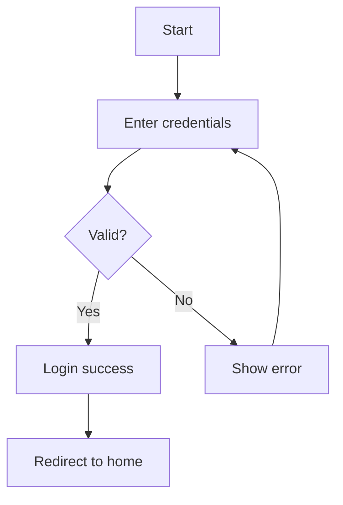

# SolarWire PRD to Test Case Generator

## Configuration

- **Input**: `.solarwire/[requirement-name]/solarwire-prd.md`
- **Output**: `.solarwire/[requirement-name]/test-cases.xlsx`

---

## Overview

This skill generates comprehensive test case documentation from SolarWire PRD documents, extracting test points from:

1. **SolarWire Wireframe Notes** - UI interactions, input rules, business logic
2. **User Stories** - Acceptance criteria (Given-When-Then format)
3. **Business Flow Diagrams** - Process flow test scenarios
4. **Feature List** - Feature-level test coverage

**Focus**: Black-box functional testing only (no performance, security, or automated script testing)

---

## Workflow

### Phase 1: Input Validation

```
Please provide the path to the PRD markdown file.

Expected format: .solarwire/[requirement-name]/solarwire-prd.md

Or provide the requirement name, and I'll look for the PRD file.
```

### Phase 2: PRD Analysis

Parse the PRD document and extract:

1. **Document Information** - Project name, version, modules
2. **User Stories** - All user stories with acceptance criteria
3. **Feature List** - All features with priorities
4. **Business Flows** - Mermaid diagrams for process flows
5. **Page Details** - All SolarWire code blocks with notes

### Phase 3: Test Case Generation

Generate test cases from each source:

| Source | Test Case Types |
|--------|-----------------|
| SolarWire Notes | UI interaction, input validation, business logic |
| User Stories | Acceptance tests, scenario tests |
| Business Flows | Process flow tests, path coverage |
| Feature List | Feature coverage tests |

### Phase 4: Excel Output

Generate Excel file with multiple sheets:

- **Sheet 1: All Test Cases** - Complete test case list
- **Sheet 2: By Module** - Test cases grouped by module/page
- **Sheet 3: Statistics** - Test case count summary

---

## Test Case Fields

### Standard Fields

| Field | Description | Example |
|-------|-------------|---------|
| 用例编号 | Auto-increment ID | TC-001 |
| 所属模块 | Page/module from SolarWire | 登录页面 |
| 用例名称 | Brief test scenario | 正常登录成功 |
| 测试类型 | Functional/UI/Boundary/Exception | 功能测试 |
| 前置条件 | Prerequisites for test | 用户已注册，账号状态正常 |
| 测试步骤 | Numbered operation steps | 1. 打开登录页面\n2. 输入用户名\n3. 输入密码\n4. 点击登录 |
| 测试数据 | Input data for test | 用户名: test@example.com, 密码: Test123 |
| 预期结果 | Expected outcome | 登录成功，跳转到首页 |
| 优先级 | P0/P1/P2 | P0 |

### Extended Fields

| Field | Description | Example |
|-------|-------------|---------|
| 关联需求 | User story ID | US-001 |
| 测试类型细分 | More specific type | 表单验证/按钮交互/数据显示 |
| 备注 | Additional notes | 需要测试多种浏览器 |

### Complete Fields

| Field | Description | Example |
|-------|-------------|---------|
| 边界值 | Boundary test data | 用户名: 1字符, 50字符, 51字符 |
| 异常场景 | Exception scenarios | 网络断开时登录 |
| 测试数据说明 | Data preparation guide | 需要准备已注册的测试账号 |

---

## Extraction Rules

### 1. From SolarWire Notes

#### Note Structure Analysis

```solarwire
["Login"] @(100,50) note="Login button
1. Click action
   - Validate username and password
2. Success handling
   - Save login state
   - Redirect to homepage
3. Failure handling
   - Display error: 'Invalid credentials'
4. Disabled conditions
   - Disabled when username or password is empty"
```

**Extracted Test Cases:**

| Type | Scenario | Steps | Expected |
|------|----------|-------|----------|
| 功能测试 | 正常登录 | 输入有效用户名密码，点击登录 | 登录成功，跳转首页 |
| 异常测试 | 登录失败 | 输入无效用户名密码，点击登录 | 显示错误提示 |
| UI测试 | 按钮禁用状态 | 用户名或密码为空 | 登录按钮禁用 |

#### Note Section Mapping

| Note Section | Test Case Type | Priority |
|--------------|----------------|----------|
| Click action | 功能测试 | P0 |
| Success handling | 功能测试 | P0 |
| Failure handling | 异常测试 | P1 |
| Disabled conditions | UI测试 | P1 |
| Input rules | 边界测试 | P1 |
| Validation | 表单验证 | P0 |
| Visibility conditions | UI测试 | P1 |
| Data source | 数据验证 | P1 |

#### Input Rules Extraction

```solarwire
["Enter password"] note="Password input
1. Input rules
   - Password displayed as dots
   - Minimum 6 characters, maximum 32 characters
   - Must contain both letters and numbers"
```

**Generated Boundary Tests:**

| Test Case | Data | Expected |
|-----------|------|----------|
| 最小长度边界 | 5字符 | 提示：密码长度不足 |
| 最小长度有效 | 6字符 | 通过 |
| 最大长度有效 | 32字符 | 通过 |
| 最大长度边界 | 33字符 | 提示：密码长度超限 |
| 格式验证-纯数字 | 123456 | 提示：必须包含字母 |
| 格式验证-纯字母 | abcdef | 提示：必须包含数字 |

### 2. From User Stories

#### Given-When-Then Extraction

```markdown
| US-001 | As a user, I want to login, so that I can access my account | 
  - Given user is on login page, when entering valid credentials, then login succeeds
  - Given user is on login page, when entering invalid credentials, then error shows
```

**Generated Test Cases:**

| ID | Scenario | Given | When | Then |
|----|----------|-------|------|------|
| TC-XXX | 用户登录-有效凭证 | 用户在登录页面 | 输入有效凭证并提交 | 登录成功 |
| TC-XXX | 用户登录-无效凭证 | 用户在登录页面 | 输入无效凭证并提交 | 显示错误提示 |

### 3. From Business Flow Diagrams

#### Mermaid Flowchart Analysis



**Generated Test Cases:**

| ID | Scenario | Path |
|----|----------|------|
| TC-XXX | 正常登录流程 | A→B→C(Yes)→D→F |
| TC-XXX | 登录失败重试 | A→B→C(No)→E→B |

### 4. From Feature List

```markdown
| Module | Feature | Priority | Description |
|--------|---------|----------|-------------|
| 用户管理 | 用户登录 | P0 | 支持用户登录功能 |
```

**Generated Test Case:**

| ID | Module | Feature | Test Scenario |
|----|--------|---------|---------------|
| TC-XXX | 用户管理 | 用户登录 | 验证用户登录功能正常工作 |

---

## Test Case Naming Convention

### Format

```
[模块名]-[功能点]-[测试场景]-[状态(可选)]
```

### Examples

| Test Case Name | Description |
|----------------|-------------|
| 登录页面-登录功能-正常登录成功 | 正常登录流程 |
| 登录页面-登录功能-密码错误登录失败 | 异常登录 |
| 登录页面-用户名输入-最小长度边界 | 边界测试 |
| 用户列表-数据表格-分页功能 | 功能测试 |
| 用户列表-删除按钮-批量删除确认弹窗 | UI交互测试 |

---

## Module Organization

### By SolarWire Page

Each SolarWire code block (page) generates test cases grouped under that module:

```markdown
### 5.1 Login Page
```solarwire
!title="Login"
...
```

**Module**: 登录页面

### 5.2 User List Page
```solarwire
!title="User List"
...
```

**Module**: 用户列表页面

### Modal Handling

Modals are treated as sub-modules:

```markdown
### 5.3 Delete Confirmation Modal
```solarwire
!title="Delete Confirmation Modal"
...
```

**Module**: 用户列表页面 > 删除确认弹窗

---

## Priority Rules

### Inherited Priority

| Source Priority | Test Case Priority |
|-----------------|-------------------|
| User Story P0 | P0 |
| User Story P1 | P1 |
| User Story P2 | P2 |
| Feature P0 | P0 |
| Feature P1 | P1 |

### Test Type Priority

| Test Type | Default Priority |
|-----------|-----------------|
| 功能测试 - 核心流程 | P0 |
| 功能测试 - 辅助功能 | P1 |
| 表单验证 | P0 |
| 边界测试 | P1 |
| 异常测试 | P1 |
| UI测试 | P2 |

---

## Excel Output Format

### Sheet 1: 测试用例汇总

| Column | Width | Format |
|--------|-------|--------|
| 用例编号 | 10 | Text |
| 所属模块 | 15 | Text |
| 用例名称 | 30 | Text |
| 测试类型 | 12 | Text |
| 前置条件 | 25 | Text (wrap) |
| 测试步骤 | 40 | Text (wrap) |
| 测试数据 | 20 | Text |
| 预期结果 | 30 | Text (wrap) |
| 优先级 | 8 | Text |
| 关联需求 | 10 | Text |
| 边界值 | 20 | Text |
| 异常场景 | 20 | Text |
| 备注 | 20 | Text |

### Sheet 2: 按模块分组

Each module gets a section with:
- Module header (merged cells, bold)
- Test cases for that module

### Sheet 3: 测试统计

| Metric | Value |
|--------|-------|
| 总用例数 | N |
| P0用例数 | N |
| P1用例数 | N |
| P2用例数 | N |
| 功能测试 | N |
| 边界测试 | N |
| 异常测试 | N |
| UI测试 | N |
| 按模块统计 | ... |

---

## Test Case Generation Rules

### Fine-Grained Principle

Each distinct behavior in a note generates a separate test case:

**Note:**
```solarwire
["Submit"] note="Submit button
1. Click action
   - Validate form data
   - Submit to server
2. Success handling
   - Show success message
   - Refresh list
3. Failure handling
   - Show error message
   - Keep form data"
```

**Generated Test Cases (4 cases):**

1. 功能测试: 提交表单-验证通过后提交
2. 功能测试: 提交成功-显示成功消息并刷新列表
3. 异常测试: 提交失败-显示错误消息并保留数据
4. 表单验证: 表单数据验证

### Black-Box Testing Only

**Include:**
- Functional testing
- UI interaction testing
- Input validation testing
- Boundary testing
- Business logic testing
- User flow testing

**Exclude:**
- Performance testing
- Load testing
- Security penetration testing
- Database testing
- API response time testing
- Automated script testing

---

## Usage

### Command Line

```bash
node generate-testcases.js .solarwire/[requirement-name]/solarwire-prd.md
```

### Output

```
.solarwire/[requirement-name]/
├── solarwire-prd.md
├── test-cases.xlsx          # Generated test cases
└── *.svg                    # Existing SVG files
```

---

## Example Output

### Input PRD Note

```solarwire
["Username"] @(100,220)
["Enter phone or email"] @(100,245) w=300 h=44 note="Username input
1. Input rules
   - Supports phone number or email
   - Automatically trims leading/trailing spaces
   - Max length: 50 characters
2. Validation
   - Format: 11-digit phone number or email format
   - Error message: 'Please enter a valid phone number or email'"
```

### Generated Test Cases

| ID | Module | Name | Type | Steps | Data | Expected | Priority |
|----|--------|------|------|-------|------|----------|----------|
| TC-001 | 登录页面 | 用户名输入-手机号格式 | 表单验证 | 1.输入11位手机号 | 13812345678 | 通过 | P0 |
| TC-002 | 登录页面 | 用户名输入-邮箱格式 | 表单验证 | 1.输入邮箱格式 | test@example.com | 通过 | P0 |
| TC-003 | 登录页面 | 用户名输入-无效格式 | 表单验证 | 1.输入无效格式 | abc123 | 显示错误提示 | P0 |
| TC-004 | 登录页面 | 用户名输入-最大长度 | 边界测试 | 1.输入50字符 | 50个字符的字符串 | 通过 | P1 |
| TC-005 | 登录页面 | 用户名输入-超长 | 边界测试 | 1.输入51字符 | 51个字符的字符串 | 显示错误提示 | P1 |
| TC-006 | 登录页面 | 用户名输入-空格处理 | 功能测试 | 1.输入带空格的用户名 | " test@example.com " | 自动去除空格 | P1 |

---

## Important Reminders

1. **Black-Box Only** - Focus on user-visible behavior, not internal implementation
2. **Fine-Grained** - Each behavior point generates a separate test case
3. **Page-Based Modules** - Organize by SolarWire page/title
4. **Priority Inheritance** - Inherit priority from user stories and features
5. **Complete Coverage** - Cover all notes, user stories, flows, and features
6. **Valid Excel** - Ensure Excel file can be opened and edited
7. **Chinese Output** - Use Chinese for field names and test case content (unless PRD is in another language)
