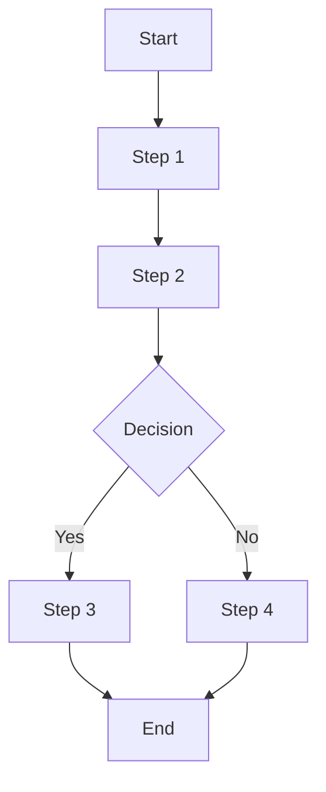
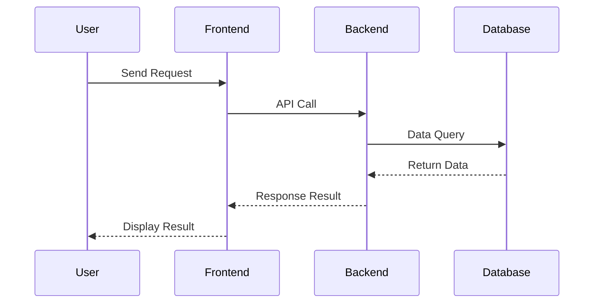

# SolarWire PRD Generator

## Configuration

- **Output Directory**: `.solarwire` (modify here if needed)

---

## Overview

This skill generates complete Product Requirements Documents (PRD), including:
1. **Complete PRD Document** (.md format)
2. **Mermaid Flowcharts/Sequence Diagrams**
3. **SolarWire Wireframes** (each page with complete information and element descriptions)
4. **SVG Rendered Images** (with notes and without notes versions)

---

## Workflow

### Phase 1: Requirements Collection

**Goal: Confirm user requirements step by step, don't rush to generate**

```
Great! I'll help you create a PRD document. Let's confirm the requirements step by step:

**Step 1: Product Type**
What type of application is this?
- 📱 Mobile App
- 💻 Web Client
- ⚙️ Admin Dashboard
- 📺 Other (please describe)

Please select or describe your product type.
```

### Phase 2: Feature Confirmation

```
**Step 2: Core Features**
What core features/pages does this product need?

For example:
- User Login/Register
- Home Page
- Profile Center
- Product List
- Order Management
...
```

### Phase 3: Detailed Requirements

```
**Step 3: Detailed Requirements Confirmation**

Here's my understanding of the requirements:

**Product Type**: [Type]
**Core Pages**:
1. [Page 1] - [Brief description]
2. [Page 2] - [Brief description]
3. ...

**Special Requirements**:
- [Requirement 1]
- [Requirement 2]

Is this understanding correct? Any adjustments or additions needed?
```

### Phase 3.5: Multi-language Requirements

```
**Step 3.5: Multi-language Support Confirmation**

Does this project require multi-language support?

If yes:
- Which languages need to be supported?
- Common options: English, 中文, 日本語, 한국어, Deutsch, Français, Español, etc.
- The default language will be set based on your primary language.

If no:
- All notes will be written in the default language only.
- No i18n information will be added to any elements.
```

**⚠️ IMPORTANT: Multi-language Rules**

1. **Only when explicitly confirmed**: Add i18n information ONLY when user explicitly confirms multi-language support is needed
2. **Never add i18n if not requested**: If user says no multi-language, absolutely DO NOT add any i18n information
3. **All meaningful elements**: If multi-language is confirmed, ALL meaningful text elements MUST include i18n translations
4. **Default language**: Based on user's primary language (the language they use to communicate)

**Elements requiring i18n (if multi-language is confirmed):**
- Button text
- Label text
- Placeholder text
- Error/Success messages
- Table headers
- Menu items
- Page titles
- Status values

**Elements NOT requiring i18n:**
- User input data (usernames, comments, etc.)
- System generated data (IDs, timestamps, etc.)
- Decorative elements
- Icons

### Phase 4: Generate Output

After confirming requirements, generate documents with the following structure:

---

## Output File Structure

**All requirements are organized under the `.solarwire` directory, each in its own folder:**

```
.solarwire/                              # Root directory for all PRD outputs
├── [requirement-name-1]/                # Folder for requirement 1
│   ├── solarwire-prd.md                 # PRD document (fixed name)
│   ├── [page-name]-with-notes.svg       # Wireframe with notes
│   ├── [page-name]-without-notes.svg    # Wireframe without notes
│   └── ...                              # More SVGs for this requirement
│
├── [requirement-name-2]/                # Folder for requirement 2
│   ├── solarwire-prd.md
│   └── ...
│
└── ...                                  # More requirement folders
```

**Naming Convention:**
- Root directory: `.solarwire` (at project root)
- Requirement folder: Based on the requirement/project name (e.g., `user-login-system/`, `order-management/`)
- PRD file: Always named `solarwire-prd.md`
- SVG files: Based on the `!title` attribute in each solarwire code block
  - Format: `[title-value]-with-notes.svg` and `[title-value]-without-notes.svg`
  - Title is converted to lowercase kebab-case (e.g., `!title="User Login"` → `user-login-with-notes.svg`)

---

## SVG Generation

This skill is **fully portable**. All dependencies are bundled in the `lib` directory.

After generating the PRD markdown file, run the SVG generation script:

```bash
node generate-svg.js .solarwire/[requirement-name]/solarwire-prd.md
```

**The script will:**
- Extract all `solarwire` code blocks from the markdown file
- Generate two SVG files for each block:
  - `[page-name]-with-notes.svg` - Includes note annotations
  - `[page-name]-without-notes.svg` - Clean wireframe only
- Save files to the same directory as the markdown file (the requirement folder)

**Updating Dependencies:**

If you need to update the bundled dependencies:

```bash
# Build the latest parser and renderer
cd SolarWire/packages/core/parser && npm run build
cd SolarWire/packages/core/renderer-svg && npm run build

# Copy to skill lib directory
cp -r SolarWire/packages/core/parser/dist/* solarwire-prd/lib/parser/
cp -r SolarWire/packages/core/renderer-svg/dist/* solarwire-prd/lib/renderer-svg/
```

---

## PRD Document Structure

```markdown
# Product Requirements Document - [Project Name]

## Document Information
| Project Name | [Project Name] |
|-------------|----------------|
| Version | v1.0 |
| Created Date | [Date] |
| Author | [Author] |

---

## 1. Product Overview

### 1.1 Product Background
[Brief description of product background and goals]

### 1.2 Target Users
[Description of target user groups]

### 1.3 Core Value
[Core value provided to users by the product]

### 1.4 User Stories

**Format: As a [user role], I want to [action], so that [benefit]**

| ID | User Story | Acceptance Criteria | Priority |
|----|------------|---------------------|----------|
| US-001 | As a [role], I want to [action], so that [benefit] | - Given [context], when [action], then [result] | P0 |
| US-002 | As a [role], I want to [action], so that [benefit] | - Given [context], when [action], then [result] | P0 |
| US-003 | As a [role], I want to [action], so that [benefit] | - Given [context], when [action], then [result] | P1 |

**User Story Writing Guidelines:**
- **User Role**: Identify who the user is (e.g., "As a registered user", "As an admin")
- **Action**: What the user wants to do (e.g., "I want to reset my password")
- **Benefit**: Why the user wants this (e.g., "so that I can regain access to my account")
- **Acceptance Criteria**: Use Given-When-Then format to define testable conditions
- **Priority**: P0 (Must have), P1 (Should have), P2 (Nice to have)

---

## 2. Feature Scope

### 2.1 Feature List
| Module | Feature | Priority | Description |
|--------|---------|----------|-------------|
| [Module 1] | [Feature 1] | P0 | [Description] |
| [Module 1] | [Feature 2] | P1 | [Description] |

### 2.2 Feature Boundary
- Included: [List included features]
- Not Included: [List excluded features]

---

## 3. Business Flow

### 3.1 Core Business Flowchart


### 3.2 Interaction Sequence Diagram


---

## 4. Page Design

### 4.1 Page List
| Page Name | Page Type | Description |
|-----------|-----------|-------------|
| [Page 1] | Main Page | [Description] |
| [Page 2] | Modal | [Description] |

---

## 5. Page Details

> **Core Principle: All element descriptions are integrated into the SolarWire wireframe notes for "what you see is what you read"**

### 5.1 [Page Name]

**Page Overview**: [One sentence describing the core functionality of the page]

```solarwire
!title="[Page Name]"
!c=#333333
!size=13
!bg=#F2F2F2
!r=0

// Container Rectangle
[] @(0,0) w=1440 h=900 bg=#FFFFFF

// Page Content - Each element has detailed note description
["Logo"] @(50,50) w=120 h=60 note="Logo
1. Click action
   - Return to homepage"

"User Login" @(100,150) size=24 bold

"Username" @(100,220)
["Enter phone or email"] @(100,245) w=300 h=44 bg=#FFFFFF b=#F2F2F2 note="Username input
1. Input rules
   - Supports phone number or email
   - Automatically trims leading/trailing spaces
   - Max length: 50 characters
2. Validation
   - Format: 11-digit phone number or email format
   - Error message: 'Please enter a valid phone number or email'"

"Password" @(100,310)
["Enter password"] @(100,335) w=300 h=44 bg=#FFFFFF b=#F2F2F2 note="Password input
1. Input rules
   - Password displayed as dots
   - Min length: 6 characters, Max: 32 characters
   - Must contain letters and numbers
2. Interaction
   - Show/hide toggle icon on the right"

["Remember Me"] @(100,400) w=16 h=16 note="Remember me checkbox
1. Behavior
   - When checked: Stay logged in for 7 days
   - Unchecked by default"
"Remember Me" @(124,402)

"Forgot Password?" @(320,400) c=#1890FF note="Forgot password link
1. Click action
   - Navigate to password recovery page"

["Login"] @(100,450) w=300 h=48 bg=#1890FF c=#FFFFFF size=16 note="Login button
1. Click action
   - Validate username and password
2. Success handling
   - Save login state
   - Redirect to homepage
3. Failure handling
   - Display modal: 'Invalid username or password'
   - Clear password field
4. Disabled conditions
   - Disabled when username or password is empty"

"Or login with" @(160,530) c=#AAAAAA

[?"WeChat Work"] @(120,560) w=40 h=40 note="WeChat Work login
1. Click action
   - WeChat Work QR code login"
[?"DingTalk"] @(180,560) w=40 h=40 note="DingTalk login
1. Click action
   - DingTalk QR code login"
[?"WeChat"] @(240,560) w=40 h=40 note="WeChat login
1. Click action
   - WeChat authorization login"
```

---

## 6. Non-functional Requirements

### 6.1 Performance Requirements
- Page load time: < 2 seconds
- API response time: < 500ms

### 6.2 Security Requirements
- [List security requirements]

### 6.3 Compatibility Requirements
- Browsers: Chrome 90+, Safari 14+
- Mobile: iOS 14+, Android 10+

---

## 7. Appendix

### 7.1 Glossary
| Term | Description |
|------|-------------|
| [Term 1] | [Description] |

### 7.2 References
- [Reference links]
```

---

## SolarWire Wireframe Specifications

### Core Principles (Must Strictly Follow)

#### 1. Syntax Rules

```
1. All elements must have coordinates @(x,y)
2. Write attributes directly without brackets: w=100 h=40 (not [w=100 h=40])
3. Text content MUST use double quotes: "Login" (not Login)
4. Attribute order: Content → Coordinates → Size → Other attributes → note
```

**Correct Example:**
```solarwire
["Login"] @(100,50) w=100 h=40 bg=#1890FF c=#FFFFFF note="Submit login form"
"Username" @(100,100)
(("Avatar")) @(100,150) w=40  // Circle with text - MUST use double quotes
```

**Incorrect Example:**
```solarwire
["Login"]                    // ❌ No coordinates
["Login"] [w=100 h=40]       // ❌ Attributes in brackets
["Login"] @(100,50) w=100    // ❌ Missing height
((Avatar)) @(100,50) w=40    // ❌ Text without double quotes - WRONG!
(("Avatar")) @(100,50) w=40  // ✅ Correct - text in double quotes
```

**⚠️ IMPORTANT: All text content MUST be wrapped in double quotes `""`**

| Element | Correct | Incorrect |
|---------|---------|-----------|
| Rectangle | `["Button"]` | `[Button]` |
| Circle | `(("Avatar"))` | `((Avatar))` |
| Rounded | `("Card")` | `(Card)` |
| Plain Text | `"Label"` | `Label` |

#### 2. Element Selection Principles

**Choose appropriate element types based on actual UI components:**

| Scenario | Recommended Element | Example |
|----------|---------------------|---------|
| Primary Buttons | Rectangle `[]` with background color | `["Login"] @(100,50) w=100 h=40 bg=#1890FF c=#FFFFFF` |
| Secondary Buttons | Rectangle `[]` with border | `["Cancel"] @(220,50) w=80 h=40 bg=#FFFFFF b=#F2F2F2` |
| Cards/Containers | Rounded Rectangle `()` | `("User Info Card") @(100,50) w=300 h=200` |
| Avatars | Circle with placeholder | `(("A")) @(100,50) w=40 bg=#F2F2F2 c=#AAAAAA` |
| Icon Buttons | Circle with icon text | `(("?")) @(100,50) w=32 h=32 bg=#F2F2F2` |
| Labels/Text | Plain Text `""` | `"Username" @(100,50)` |
| Input Fields | Rectangle with placeholder | `["Enter username..."] @(100,50) w=280 h=40 bg=#FFFFFF b=#F2F2F2 c=#AAAAAA` |
| Dividers | Line `--` | `-- @(0,100)->(400,100) b=#F2F2F2` |
| Data Tables | Table `##` | `## @(100,50) w=500 border=1` |

**⚠️ CRITICAL: Text Content Syntax**

| Element | Correct Syntax | Wrong Syntax |
|---------|---------------|--------------|
| Rectangle | `["Button Text"]` | `[Button Text]` ❌ |
| Rounded | `("Card Title")` | `(Card Title)` ❌ |
| Circle | `(("Avatar"))` | `((Avatar))` ❌ |
| Plain Text | `"Label"` | `Label` ❌ |

**Common Mistakes to Avoid:**
- ❌ `((Avatar))` - Text without double quotes
- ❌ `[Login]` - Text without double quotes
- ❌ Using placeholder `[?]` for buttons (use `["Button Text"]` instead)
- ❌ Using rectangle `[]` for plain labels (use `"Label"` instead)
- ❌ Overcrowding elements - use 10px spacing

#### 3. Page Organization Rules

**Each SolarWire code block handles only one independent view:**

| Situation | Handling Method | Example |
|-----------|-----------------|---------|
| Modals/Dialogs | Separate SolarWire fragment | `## Login Failed Modal` + independent code block |
| Different Page States | Separate fragment for each state | `## Login Page - Loading State`, `## Login Page - Error State` |
| Tab Switching | Separate fragment for each tab | `## Settings Page - Basic Info Tab`, `## Settings Page - Security Tab` |

**Do not mix multiple view states in one code block.**

#### 4. Container Rectangle Requirements

**Every page must have a container rectangle:**

```solarwire
!title="Page Name"
!c=#333333
!size=13
!bg=#F2F2F2
!r=0

// Container Rectangle - Represents screen/device boundary, placed at the beginning
[] @(0,0) w=375 h=812 bg=#FFFFFF

// Page content...
```

**Container Rectangle Specifications:**
- Place at the beginning of the code block
- Use `[]` rectangle (don't display text content)
- `bg=#FFFFFF` white background
- Dimensions by scenario:
  - Mobile: `w=375 h=812` (iPhone X) or `w=390 h=844` (iPhone 12+)
  - Web: `w=1440 h=900` or as needed
  - Admin Dashboard: `w=1920 h=1080`

**Container Size Principle: Container must contain all child elements**

**Forbidden: Child elements extending beyond parent container boundaries.**

#### 5. Note Writing Guidelines

**Core Principle: Notes describe functional behavior and business logic, not visual details or technical implementation**

---

##### 1. When to Write Notes

**Write notes for:**
- Interactive elements (buttons, links, etc.)
- Input elements with validation or logic
- Dropdowns (selection behavior, options source)
- Data display elements with complex rules (tables, lists)
- Elements with business logic (calculations, conditions)
- Complex concepts requiring additional explanation

**Skip notes for:**
- Pure visual elements (dividers, containers, decorative icons)
- Static labels and titles

**Common Sense Exemption (no note needed unless special behavior):**
- Back button (standard behavior: return to previous page)
- Close button
- Page selector
- Number stepper/incrementer

**Note:** If exempted elements have special validation or interaction, they MUST be documented.

---

##### 2. Note Structure Format

**Format Rules:**
```
First line: Element definition (what this element is, NOT element type)
First level: Numbered (1. 2. 3.)
Second level: - or # (if third level exists)
Third level: -- or -
```

**Example:**
```solarwire
["Enter password"] @(100,100) w=280 h=40 note="Password input
1. Input rules
   - Password displayed as dots
   - Minimum 6 characters, maximum 32 characters
   - Must contain both letters and numbers
2. Interaction
   - Show/hide toggle icon on the right
   - Validate format on blur
   - Display error on format failure: 'Invalid password format'
3. Special notes
   - Lock account for 15 minutes after 5 consecutive errors"
```

---

##### 3. First Line: Element Definition

**The first line of a note MUST define what this element is (functional description, NOT element type).**

| Correct | Incorrect |
|---------|-----------|
| `Password input` | `[Password Field]` |
| `Username input` | `[Input Field]` |
| `User data table` | `[Data Table]` |
| `Submit form button` | `[Primary Button]` |

---

##### 4. Content Requirements by Element Type

**Interactive/Operational Elements:**

Must include:
- What happens on click/operation
- Success/failure handling
- Disabled conditions
- Special handling (debounce, throttle, etc.)

**Example:**
```solarwire
["Login"] @(100,50) w=100 h=40 note="Login button
1. Click action
   - Validate username and password
   - Submit login request if validation passes
2. Success handling
   - Save login state
   - Redirect to homepage
3. Failure handling
   - Display error: 'Invalid username or password'
   - Clear password field
4. Disabled conditions
   - Disabled when username or password is empty"
```

**Elements with Logic:**

Must include:
- Show/hide conditions
- Calculation rules
- Validation rules
- State transitions

**Example:**
```solarwire
["Batch Delete"] @(200,50) w=100 h=36 note="Batch delete button
1. Visibility conditions
   - Show when ≥ 1 items selected
   - Hide when no items selected
2. Click action
   - Show confirmation: 'Delete N selected items?'
   - Execute batch delete on confirmation"
```

**Data Display Elements:**

Must include:
- **Data source**: Module, page, or operation (NOT API/technical details); include formula if calculated
- **Display fields and rules**: Field meanings, formats, special handling
- **Sorting rules**: Default sort, sortable fields

**Example:**
```solarwire
## @(100,50) w=500 border=1 note="User list table
1. Data source
   - User list data from User Management module
   - Default sort: creation time descending
2. Field descriptions
   - ID: Unique user identifier
   - Username: Display nickname, show 'Not set' if empty
   - Status: 1='Active', 0='Disabled', disabled shown in red
   - Created: Format as YYYY-MM-DD HH:mm
3. Sorting rules
   - Support sorting by username and created time"
```

**Calculated field example:**
```solarwire
"Total: ¥1,234.00" @(100,50) note="Order total amount
1. Data source
   - Formula: Sum of item amounts + Shipping - Discount
   - Item amount = Unit price × Quantity"
```

**Tooltip/Toast:**

Describe directly in note, no separate wireframe needed.

**Example:**
```solarwire
["?"] @(100,50) w=16 h=16 note="Help icon
1. Tooltip content
   - Hover to show: 'Supports phone number or email login'"
```

---

##### 5. Note Writing Principles

| Principle | Description |
|-----------|-------------|
| **Necessity** | Only write for meaningful elements, avoid over-documentation |
| **Completeness** | Fully describe the element, cover all aspects |
| **Single Responsibility** | Only describe current element; affected elements document in their own notes |
| **Organization** | Use standard format, clear hierarchy |
| **Self-explanatory** | Element definition should be clear, no need for secondary explanation |
| **Business-focused** | Describe business logic, avoid technical implementation details |

---

##### 6. Content Forbidden in Notes

**NEVER include:**

| Forbidden | Example (Don't Write) |
|-----------|----------------------|
| Colors | "Button is blue", "Text color #333" |
| Fonts | "Font size 14px", "Bold text" |
| Sizes | "Width 100px", "Height 40px" |
| Spacing | "Margin 16px", "Padding 8px" |
| Border | "Border radius 8px" |
| Shadows | "Box shadow 0 2px 4px" |
| Animations | "Fade in 0.3s" |
| Technical details | "API: /api/login", "Database: user_id" |

**Why?** These are:
- Already shown visually in wireframe
- Design decisions to be made later
- Subject to change during implementation

---

##### 7. Multi-language (i18n) Support

**⚠️ CRITICAL: Only add i18n when user explicitly confirms multi-language support is needed**

**If user does NOT need multi-language:**
- Do NOT add any i18n information to any element
- Write notes in the user's primary language only

**If user confirms multi-language support:**
- ALL meaningful text elements MUST include i18n translations
- Use full language names (e.g., "English", "中文", "日本語") instead of language codes
- Default language is based on user's primary language

---

**i18n Format for Single Text Element:**

```solarwire
["Login"] @(100,50) w=100 h=40 note="Login button
1. Click action
   - Validate username and password
2. i18n: English=Login, 中文=登录, 日本語=ログイン"
```

**Format:** `i18n: Language1=Text1, Language2=Text2, Language3=Text3`

---

**i18n Format for Multiple Text Elements (e.g., buttons in a group):**

```solarwire
["Cancel"] @(100,50) w=80 h=36 note="Cancel button
1. Click action
   - Close dialog without saving
2. i18n: English=Cancel, 中文=取消, 日本語=キャンセル"

["Confirm"] @(200,50) w=80 h=36 note="Confirm button
1. Click action
   - Save changes and close dialog
2. i18n: English=Confirm, 中文=确认, 日本語=確認"
```

---

**i18n Format for Table with Multiple Fields:**

Use compact format with language names declared once:

```solarwire
## @(100,50) w=600 border=1 note="User list table
1. Data source
   - User list data from User Management module
2. Fields (i18n: English/中文/日本語)
   - ID: Unique user identifier [ID/ID/ID]
   - Name: User display name [Name/用户名/ユーザー名]
   - Status: 1=Active, 0=Disabled [Status/状态/ステータス]
     - Values: Active/正常/有効, Disabled/禁用/無効
   - Created: Account creation time [Created/创建时间/作成日時]
   - Actions: View and edit operations [Actions/操作/操作]
3. Buttons (i18n: English/中文/日本語)
   - View [View/查看/表示]
   - Edit [Edit/编辑/編集]
   - Delete [Delete/删除/削除]"
```

**Format for table fields:**
- Declare languages once: `Fields (i18n: Language1/Language2/Language3)`
- Each field: `- FieldName: Description [Text1/Text2/Text3]`
- Status values: `Values: Value1/Lang1/Lang2, Value2/Lang1/Lang2`

---

**i18n Format for Dropdown Options:**

```solarwire
["Select status"] @(100,50) w=200 h=36 note="Status dropdown
1. Options (i18n: English/中文/日本語)
   - All [All/全部/すべて]
   - Active [Active/正常/有効]
   - Disabled [Disabled/禁用/無効]
2. Default: All"
```

---

**i18n Format for Error/Success Messages:**

```solarwire
["Submit"] @(100,50) w=100 h=40 note="Submit button
1. Click action
   - Validate and submit form data
2. Success message
   - i18n: English=Submitted successfully, 中文=提交成功, 日本語=送信成功
3. Error messages
   - Network error: i18n: English=Network error, please try again, 中文=网络错误，请重试, 日本語=ネットワークエラー、再試行してください
   - Validation error: i18n: English=Please check your input, 中文=请检查您的输入, 日本語=入力内容を確認してください"
```

---

##### 8. Examples: Good vs Bad Notes

**❌ Bad Note (Visual details + element type label):**
```solarwire
["Login"] @(100,50) w=100 h=40 note="[Primary Button]
- Blue background, white text
- Border radius 8px
- API: POST /api/auth/login"
```

**✅ Good Note (Functional behavior):**
```solarwire
["Login"] @(100,50) w=100 h=40 note="Login button
1. Click action
   - Validate username and password
2. Success handling
   - Save login state
   - Redirect to homepage
3. Failure handling
   - Display error: 'Invalid credentials'
4. Disabled conditions
   - Disabled when username or password is empty"
```

**✅ No Note Needed (Visual element):**
```solarwire
-- @(0,100)->(400,100) b=#F2F2F2
```

---

## SVG Output Specifications

### Generation Requirements

Each page/tab/modal needs to generate two SVG files:

1. **With Notes Version** (`[page-name]-with-notes.svg`)
   - Contains note descriptions for all elements
   - For requirements review and development reference

2. **Without Notes Version** (`[page-name]-without-notes.svg`)
   - Displays only wireframe elements
   - For design reference and presentation

### SVG Rendering Specifications

- Use SolarWire renderer to convert solarwire code blocks in `.md` to SVG
- Ensure all elements use syntax supported by existing rules
- SVG dimensions match container rectangle dimensions
- Output path: Same directory as the `solarwire-prd.md` file (the requirement folder)

---

## Syntax Quick Reference

### Document-level Declarations

```solarwire
!title="Page Title"
!c=#333333        // Default text color
!size=13          // Default font size
!bg=#F2F2F2       // Background color
!r=0              // Default border radius
```

### Basic Elements

| Symbol | Usage | Example |
|--------|-------|---------|
| `[]` | Button, input field, container | `["Confirm"] @(100,50) w=80 h=36` |
| `()` | Card, rounded container | `("Tip Card") @(100,50) w=200 h=100` |
| `(())` | Avatar, circular icon | `(("Avatar")) @(100,50) w=40` |
| `""` | Plain text, label | `"Username" @(100,50)` |
| `[?]` | Icon placeholder | `[?"Search"] @(100,50) w=32 h=32` |
| `<url>` | Real image | `<https://example.com/logo.png> @(100,50) w=40` |
| `--` | Divider line | `-- @(0,100)->(400,100)` |
| `##` | Table container | `## @(100,50) w=500 border=1` |
| `#` | Table row (MUST be inside `##`) | `  # bg=#F2F2F2` |

### Table Syntax (Indentation Required)

**Tables use strict indentation:**

```solarwire
## @(x,y) w=width border=1 note="Data table
1. Data source
   - Data from relevant module
2. Field descriptions
   - Column 1: Description
   - Column 2: Description
   - Column 3: Description"
  # bg=#F2F2F2                  // Header row (indented 2 spaces)
    "Column 1"                  // Cell (indented 4 spaces)
    "Column 2"
    "Column 3"
  #                             // Data row (indented 2 spaces)
    "Data 1"                    // Cell (indented 4 spaces)
    "Data 2"
    "Data 3"
  # bg=#FAFAFA                  // Alternating row color
    "Data 4"
    "Data 5"
    "Data 6"
```

**⚠️ Indentation Rules:**
- Table `##` - No indentation
- Row `#` - 2 spaces indentation
- Cell content - 4 spaces indentation

**⚠️ CRITICAL: Table Row Must Be Inside Table**
- Row element `#` **CANNOT exist independently** - it MUST be inside a table container `##`
- A row without a parent table is **invalid syntax**
- Table structure: `##` (container) → `#` (rows) → cells (content)

**⚠️ Table Child Element Restrictions:**
- Row `#` and cells **CANNOT have coordinates** `@(x,y)` - positions are determined by table structure
- Row `#` and cells **CANNOT have width/height** `w` `h` - sizes are determined by table container
- Row `#` and cells **CANNOT have border** `b` or `border` - border is set on table container `##`
- Only supported attributes for rows: `bg`, `c`, `size`, `bold`, `italic`, `align`
- Only supported attributes for cells: `bg`, `c`, `size`, `bold`, `italic`, `align`, `colspan`, `rowspan`

**⚠️ Table Note Rules:**
- **Table-level note**: Add `note` attribute to the table element `##` for overall table description
- **Row-level note**: `note` attribute is **NOT supported** on table rows `#`
- If you need to describe the table, put all information in the table-level note

### Common Attributes

| Attribute | Description | Example |
|-----------|-------------|---------|
| `w` `h` | Width, Height | `w=100 h=40` |
| `bg` | Background color | `bg=#1890FF` |
| `c` | Text color | `c=#FFFFFF` or `c=#333333` |
| `b` | Border color | `b=#F2F2F2` |
| `r` | Border radius | `r=8` |
| `size` | Font size | `size=16` |
| `bold` | Bold text | `bold` |
| `opacity` | Element opacity (0-1) | `opacity=0.5` for 50% transparency |
| `colspan` | Column span for table cells | `colspan=2` (merge 2 columns) |
| `rowspan` | Row span for table cells | `rowspan=2` (merge 2 rows) |
| `note` | Functional description | `note="Click to submit form"` |

### Table Row Attributes

**Table rows (`#`) support the following attributes:**
- `bg` – Background color for the entire row
- `c`, `size`, `bold`, `italic`, `align` – Text style defaults for all cells in the row

**⚠️ Important Rules:**
- `note` attribute is **NOT supported** on table rows `#`
- To describe a table, add `note` to the table element `##` instead
- Row-level attributes serve as defaults for all cells in that row
- Individual cells can override row-level attributes with their own values

**Example:**
```solarwire
## @(100,50) w=500 border=1 note="User list table
1. Data source
   - User list data from User Management module
2. Field descriptions
   - ID: Unique user identifier
   - Name: User display name
   - Actions: Edit and delete operations"
  # bg=#F2F2F2 c=#333333 bold      // Header row
    "ID"
    "Name"
    "Actions" colspan=2            // Merge 2 columns for actions
  # bg=#FAFAFA                     // Data row: alternating color
    "1"
    "John Doe"
    ["Edit"]                       // Each button in separate cell
    ["Delete"]
```

---

## Creating Clean, Realistic Wireframes

**Goal: Wireframes should look like actual UI, clean and professional**

### Key Principles

1. **Use Realistic Placeholder Content**
   - Use actual placeholder text, not generic labels
   - Example: `["Enter your email..."]` instead of `["Input"]`
   - Example: `["Login"]` instead of `["Button"]`

2. **Proper Visual Hierarchy**
   - Primary buttons: Colored background (`bg=#1890FF c=#FFFFFF`)
   - Secondary buttons: Border only (`bg=#FFFFFF b=#F2F2F2`)
   - Important elements should be larger/prominent

3. **Appropriate Element Types**
   - Buttons → Rectangle `[]` with text
   - Cards → Rounded rectangle `()`
   - Avatars → Circle with letter `(("A"))`
   - Labels → Plain text `""`
   - Inputs → Rectangle with placeholder

4. **Consistent Spacing**
   - Element spacing: 10px (unified)
   - Group related elements together
   - Use consistent margins throughout

5. **Clean Layout**
   - Don't overcrowd elements
   - Use dividers `--` to separate sections
   - Container rectangle should contain all elements

### Page Presentation Rules

| Scenario | Handling |
|----------|----------|
| New page | Draw all elements completely, including navigation, menu, etc. |
| Redesign page | Redraw completely |
| Minor changes to existing page | Mark only the changed parts on original wireframe; existing parts not modified or explained |
| New content on existing page | Add new elements to original wireframe |

**Completeness Requirements:**
- Pages must show all elements completely, including navigation, menu, and common parts
- Within the same requirement, common parts already explained in other pages do not need to be repeated
- Ensure developers have a clear concept of relative element positions on each page

### Field Presentation Rules

| Rule | Description |
|------|-------------|
| Field grouping | Group fields when there are many, for better user understanding |
| Field naming | Use common, user-friendly language; self-explanatory |
| Auxiliary explanation | When field name cannot be self-explanatory, explain via Tooltip, etc. |

### Color Standards

| Purpose | Color | Usage |
|---------|-------|-------|
| Normal text | `#333333` | Labels, content text |
| Secondary text | `#AAAAAA` | Placeholder, descriptions |
| Borders/Lines | `#F2F2F2` | Dividers, borders |
| Background | `#FFFFFF` | Page background |
| Alternating row | `#FAFAFA` | Table alternating row background |
| Primary elements | `#1890FF` | Primary buttons, links, selected state |
| Warning/Error | `#D9001B` | Error messages, warnings |

### Spacing Standards

| Rule | Value |
|------|-------|
| Element spacing | 10px (unified) |
| Font size | 13px |
| Line height | 22px |

### Other Rules

| Rule | Description |
|------|-------------|
| Images/Icons | Use sparingly in client pages to avoid affecting UI design |
| Shadows | Use sparingly |
| Layout | Clear structure, distinct functional areas |

### SolarWire Default Configuration

```solarwire
!title="Page Title"
!c=#333333        // Default text color
!size=13          // Default font size
!bg=#F2F2F2       // Page background color
!r=0              // Default border radius
```

---

## Modal Presentation Rules

**All modals MUST have a separate SolarWire wireframe, not just a simple description in a note.**

### Modal Types

| Type | Description |
|------|-------------|
| Confirmation modal | Delete confirmation, operation confirmation, etc. |
| Form modal | Create, edit, etc. |
| Information modal | Detail view, etc. |
| Alert modal | Success, failure, warning, etc. |

### Modal vs Tooltip/Toast

| Type | Handling | Description |
|------|----------|-------------|
| Modal | Separate SolarWire wireframe | Complete UI, interactions, action buttons |
| Tooltip | Describe directly in note | Simple text hint, no interaction |
| Toast | Describe directly in note | Simple message, auto-dismiss |

### Example: Modal Reference in Page Note

```solarwire
["Delete"] @(100,50) w=80 h=36 note="Delete button
1. Click action
   - Show delete confirmation modal (see 'Delete Confirmation Modal' wireframe)
   - Execute delete on confirmation
2. Success handling
   - Display Toast: 'Deleted successfully'
   - Refresh list data"
```

### Example: Separate Modal Wireframe

```solarwire
!title="Delete Confirmation Modal"
!c=#333333
!size=13
!bg=#F2F2F2

// Modal container
[] @(0,0) w=400 h=200 bg=#FFFFFF

// Modal title
"Confirm Delete" @(160,20) size=16 bold

// Modal content
"Are you sure you want to delete this item? This action cannot be undone." @(20,70) c=#333333

// Action buttons
["Cancel"] @(100,140) w=80 h=36 bg=#FFFFFF b=#F2F2F2
["Confirm"] @(220,140) w=80 h=36 bg=#D9001B c=#FFFFFF
```

### Example: Clean Login Form

```solarwire
!title="Login"
!c=#333333
!size=13
!bg=#F2F2F2

// Container
[] @(0,0) w=400 h=600 bg=#FFFFFF

// Header
"Welcome Back" @(100,80) size=24 bold
"Please sign in to continue" @(100,115) c=#AAAAAA

// Form
"Email" @(50,180)
["Enter your email"] @(50,205) w=300 h=44 bg=#FFFFFF b=#F2F2F2 c=#AAAAAA

"Password" @(50,280)
["Enter password"] @(50,305) w=300 h=44 bg=#FFFFFF b=#F2F2F2 c=#AAAAAA

["Remember me"] @(50,370) w=16 h=16 note="Remember me checkbox
1. Behavior
   - When checked: Stay logged in for 7 days
   - Unchecked by default"
"Remember me" @(74,372)

["Sign In"] @(50,420) w=300 h=48 bg=#1890FF c=#FFFFFF size=16 note="Sign in button
1. Click action
   - Validate email and password
2. Success handling
   - Save login state
   - Redirect to homepage
3. Failure handling
   - Display error: 'Invalid credentials'
4. Disabled conditions
   - Disabled when email or password is empty"

"Don't have an account?" @(115,500) c=#AAAAAA
"Sign up" @(270,500) c=#1890FF note="Sign up link
1. Click action
   - Navigate to registration page"
```

### Common Mistakes to Avoid

| Mistake | Wrong | Correct |
|---------|-------|---------|
| Generic labels | `["Button"]` | `["Sign In"]` |
| Missing placeholder | `[""]` | `["Enter email..."]` |
| Wrong element type | `"Submit"` (text) | `["Submit"]` (button) |
| Text without quotes | `((Avatar))` | `(("Avatar"))` |
| Overcrowding | Elements too close | 10px spacing |
| Wrong colors | `bg=#3498db` | `bg=#1890FF` |

---

## Scenario Specifications

### Mobile App

**Characteristics:**
- Narrow canvas (375-430px)
- Vertical layout, bottom navigation
- Touch-friendly large buttons (min 44x44px)

**Container Size:** `w=375 h=812` (iPhone X) or `w=390 h=844` (iPhone 12+)

**Element Sizes:**
- Button height: 44-56px
- Input field height: 44-52px
- Text size: 13px (default), 18-22px (titles)
- Element spacing: 10px (unified), Page margins: 16-24px

**Common Patterns:**
- Login: Logo + Title + Form + Button (full width)
- List: Search bar + List items + Pull to refresh
- Detail: Back button + Title + Content + Bottom action

**Mobile-specific Fields:**
| Field | Type | Description |
|-------|------|-------------|
| deviceToken | string | Device push token |
| deviceId | string | Device unique identifier |
| osType | string | iOS/Android |
| appVersion | string | App version |

**Mobile-specific Rules:**
- Support one-tap login, third-party login (WeChat, Apple ID)
- Token validity: 7 days
- Push notifications can be disabled

---

### Web Client

**Characteristics:**
- Wide canvas (1200-1440px)
- Horizontal layout, top navigation
- Moderate button/input sizes

**Container Size:** `w=1440 h=900`

**Element Sizes:**
- Button height: 36-48px, width: min 80px
- Input field height: 36-44px, width: 200-400px
- Text size: 13px (default), 18-24px (titles)
- Element spacing: 10px (unified), Page margins: 24-48px

**Common Patterns:**
- Login: Centered layout, Logo + Form + Button
- List: Search/filter bar + Data table + Pagination
- Detail: Breadcrumb + Title + Content cards + Actions

**Web-specific Fields:**
| Field | Type | Description |
|-------|------|-------------|
| sessionId | string | Session ID |
| userAgent | string | Browser info |
| referrer | string | Source page |

**Web-specific Rules:**
- Support password, QR code, third-party login
- Session validity: 30 min inactivity auto-expire
- Browsers: Chrome 90+, Safari 14+, Firefox 88+, Edge 90+

---

### Admin Dashboard

**Characteristics:**
- Very wide canvas (1440-1920px)
- Fixed left sidebar (200-280px)
- Data-intensive (tables, charts, cards)
- Many action buttons

**Container Size:** `w=1920 h=1080`

**Element Sizes:**
- Button height: 32-40px
- Input field height: 32-36px
- Table row height: 40-48px
- Sidebar width: 200-280px
- Text size: 13px (default), 16-20px (titles)
- Element spacing: 10px (unified), Page margins: 24-32px

**Common Patterns:**
- List: Search/filter + Batch actions + Table + Pagination
- Statistics: Multiple stat cards + Charts + Time selector
- Form: Breadcrumb + Multi-column form + Save/Cancel

**Admin-specific Fields:**
| Field | Type | Description |
|-------|------|-------------|
| operatorId | string | Operator ID |
| operateTime | datetime | Operation time |
| operateType | string | Add/Edit/Delete/Export |
| ipAddress | string | Operation IP |

**Admin-specific Rules:**
- Super Admin: Full permissions
- Admin: View/Edit, no Delete
- Operator: View/Export only
- Pagination: 20 items/page, max 10000 export
- Sensitive operations require confirmation
- Login timeout: 30 min inactivity

---

## Important Reminders

1. **Confirm Requirements Step by Step** - Don't rush to generate, fully understand requirements first
2. **Notes Describe Function and Business Logic** - Focus on behavior and logic, avoid visual details and technical implementation
3. **Not Every Element Needs a Note** - Skip notes for visual elements; common sense exemption for back button, close button, page selector, number stepper
4. **First Line Defines Element** - Note first line must describe what the element is (e.g., "Login button"), not element type (e.g., "[Primary Button]")
5. **Note Structure Required** - First line: element definition; First level: numbered (1. 2. 3.); Second level: dash (-); Third level: double dash (--)
6. **Coordinates Must Be Complete** - Every element must have `@(x,y)`
7. **No Brackets for Attributes** - Write directly `w=100 h=40`
8. **Choose Elements Reasonably** - Buttons use rectangles, labels use text, only icons use placeholders
9. **Layout Close to Reality** - Wireframes should reflect actual page structure with 10px spacing
10. **Separate Modals/States/Tabs** - Each independent view in separate code block; all modals must have separate wireframe
11. **Table Row Must Be Inside Table** - Row element `#` CANNOT exist independently, MUST be inside table container `##`
12. **Table Child Element Restrictions** - Rows and cells CANNOT have coordinates `@(x,y)`, width `w`, height `h`, or border `b`; only support style attributes (`bg`, `c`, `size`, `bold`, `italic`, `align`, `colspan`, `rowspan`)
13. **Container Rectangle Required** - First element of each page is white background container
14. **Generate Dual SVG Versions** - With notes and without notes versions
15. **Color Standards** - Use unified colors: #333333 (text), #AAAAAA (secondary), #F2F2F2 (border), #FFFFFF (bg), #FAFAFA (alternating row), #1890FF (primary), #D9001B (error)
16. **Font Standards** - Font size 13px, line height 22px
17. **i18n Only When Confirmed** - Add multi-language support ONLY when user explicitly confirms; if not confirmed, absolutely NO i18n information; if confirmed, ALL meaningful elements MUST include i18n translations using full language names (English, 中文, 日本語)
