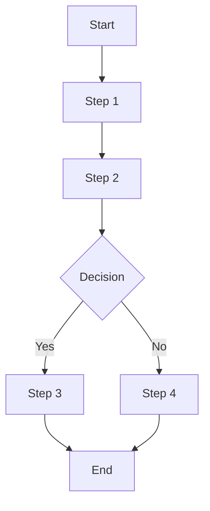
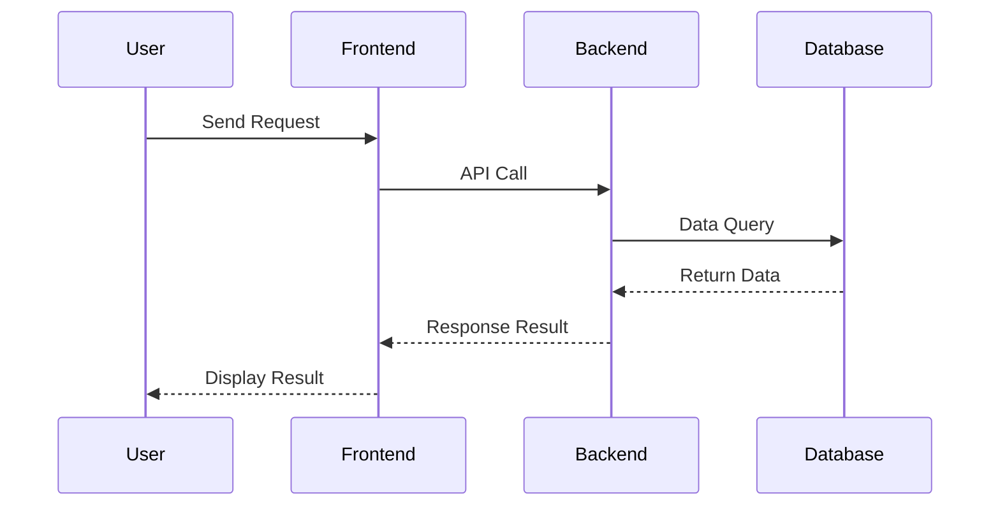

# SolarWire PRD Generator

## Configuration

- **Output Directory**: `.solarwire` (modify here if needed)

---

## Overview

This skill generates complete Product Requirements Documents (PRD), including:
1. **Complete PRD Document** (.md format)
2. **Mermaid Flowcharts/Sequence Diagrams**
3. **SolarWire Wireframes** (each page with complete information and element descriptions)
4. **SVG Rendered Images** (with notes and without notes versions)

---

## Workflow

### Phase 1: Requirements Collection

**Goal: Confirm user requirements step by step, don't rush to generate**

```
Great! I'll help you create a PRD document. Let's confirm the requirements step by step:

**Step 1: Product Type**
What type of application is this?
- 📱 Mobile App
- 💻 Web Client
- ⚙️ Admin Dashboard
- 📺 Other (please describe)

Please select or describe your product type.
```

### Phase 2: Feature Confirmation

```
**Step 2: Core Features**
What core features/pages does this product need?

For example:
- User Login/Register
- Home Page
- Profile Center
- Product List
- Order Management
...
```

### Phase 3: Detailed Requirements

```
**Step 3: Detailed Requirements Confirmation**

Here's my understanding of the requirements:

**Product Type**: [Type]
**Core Pages**:
1. [Page 1] - [Brief description]
2. [Page 2] - [Brief description]
3. ...

**Special Requirements**:
- [Requirement 1]
- [Requirement 2]

Is this understanding correct? Any adjustments or additions needed?
```

### Phase 4: Generate Output

After confirming requirements, generate documents with the following structure:

---

## Output File Structure

```
{{outputDir}}/
├── prd-[project-name].md           # Main PRD document
└── assets/
    └── [page-name]/
        ├── [page-name]-with-notes.svg    # Wireframe with notes
        └── [page-name]-without-notes.svg # Wireframe without notes
```

---

## PRD Document Structure

```markdown
# Product Requirements Document - [Project Name]

## Document Information
| Project Name | [Project Name] |
|-------------|----------------|
| Version | v1.0 |
| Created Date | [Date] |
| Author | [Author] |

---

## 1. Product Overview

### 1.1 Product Background
[Brief description of product background and goals]

### 1.2 Target Users
[Description of target user groups]

### 1.3 Core Value
[Core value provided to users by the product]

---

## 2. Feature Scope

### 2.1 Feature List
| Module | Feature | Priority | Description |
|--------|---------|----------|-------------|
| [Module 1] | [Feature 1] | P0 | [Description] |
| [Module 1] | [Feature 2] | P1 | [Description] |

### 2.2 Feature Boundary
- Included: [List included features]
- Not Included: [List excluded features]

---

## 3. Business Flow

### 3.1 Core Business Flowchart


### 3.2 Interaction Sequence Diagram


---

## 4. Page Design

### 4.1 Page List
| Page Name | Page Type | Description |
|-----------|-----------|-------------|
| [Page 1] | Main Page | [Description] |
| [Page 2] | Modal | [Description] |

---

## 5. Page Details

> **Core Principle: All element descriptions are integrated into the SolarWire wireframe notes for "what you see is what you read"**

### 5.1 [Page Name]

**Page Overview**: [One sentence describing the core functionality of the page]

```solarwire
!title="[Page Name]"
!c=#333
!size=14
!bg=#f5f7fa
!r=8

// Container Rectangle
[] @(0,0) w=1440 h=900 bg=#fff

// Page Content - Each element has detailed note description
["Logo"] @(50,50) w=120 h=60 note="Click to return to homepage"

"User Login" @(100,150) size=24 bold note="Page title"

"Username" @(100,220) note="Input field label"
["Enter phone or email"] @(100,245) w=300 h=44 bg=#fff b=#ddd note="[Input Field]
- Supports phone number or email login
- Automatically trims leading/trailing spaces
- Format validation: 11-digit phone number or email format
- Error message: Display 'Please enter a valid phone number or email' on format error
- Max length: 50 characters"

"Password" @(100,310) note="Input field label"
["Enter password"] @(100,335) w=300 h=44 bg=#fff b=#ddd note="[Password Field]
- Password displayed as dots
- Show/hide toggle icon on the right
- Min length: 6 characters, Max: 32 characters
- Must contain letters and numbers"

["Remember Me"] @(100,400) w=80 h=20 note="[Checkbox]
- When checked, stay logged in for 7 days
- Unchecked by default"

"Forgot Password?" @(320,400) c=#3498db note="[Link] Click to go to password recovery page"

["Login"] @(100,450) w=300 h=48 bg=#3498db c=white size=16 note="[Primary Button]
- Validates username and password on click
- Success: Redirect to homepage, save login state
- Failure: Display 'Invalid username or password' modal, clear password field
- Disabled when: username or password is empty
- Debounce: Button disabled for 3 seconds after click, or until request returns"

"Or login with" @(160,530) c=#999 note="Separator text"

[?"WeChat Work"] @(120,560) w=40 h=40 note="[Third-party Login] WeChat Work QR code login"
[?"DingTalk"] @(180,560) w=40 h=40 note="[Third-party Login] DingTalk QR code login"
[?"WeChat"] @(240,560) w=40 h=40 note="[Third-party Login] WeChat authorization login"
```

---

## 6. Non-functional Requirements

### 6.1 Performance Requirements
- Page load time: < 2 seconds
- API response time: < 500ms

### 6.2 Security Requirements
- [List security requirements]

### 6.3 Compatibility Requirements
- Browsers: Chrome 90+, Safari 14+
- Mobile: iOS 14+, Android 10+

---

## 7. Appendix

### 7.1 Glossary
| Term | Description |
|------|-------------|
| [Term 1] | [Description] |

### 7.2 References
- [Reference links]
```

---

## SolarWire Wireframe Specifications

### Core Principles (Must Strictly Follow)

#### 1. Syntax Rules

```
1. All elements must have coordinates @(x,y)
2. Write attributes directly without brackets: w=100 h=40 (not [w=100 h=40])
3. Text content must use double quotes: "Login" (not Login)
4. Attribute order: Content → Coordinates → Size → Other attributes → note
```

**Correct Example:**
```solarwire
["Login"] @(100,50) w=100 h=40 bg=#3498db c=white note="Submit login form"
"Username" @(100,100)
```

**Incorrect Example:**
```solarwire
["Login"]                    // ❌ No coordinates
["Login"] [w=100 h=40]       // ❌ Attributes in brackets
["Login"] @(100,50) w=100    // ❌ Missing height
```

#### 2. Element Selection Principles

**Goal: Wireframes should be clean, clear, and close to actual page display**

| Scenario | Recommended Element | Example |
|----------|---------------------|---------|
| Button Actions | Rectangle `[]` | `["Login"] @(100,50) w=100 h=40 bg=#3498db c=white` |
| Cards/Containers | Rounded Rectangle `()` | `("User Info Card") @(100,50) w=300 h=200` |
| Avatars/Icon Buttons | Circle `(())` | `((Avatar)) @(100,50) w=40` |
| Labels/Text | Plain Text `""` | `"Username" @(100,50)` |
| Input Fields | Rectangle + Placeholder Text | `["Enter username"] @(100,50) w=280 h=40 bg=#fff b=#ddd` |
| Icons (no real image) | Placeholder `[?]` | `[?"Search"] @(100,50) w=32 h=32` |
| Real Images | Image `<url>` | `<https://example.com/logo.png> @(100,50) w=40` |
| Dividers | Line `--` | `-- @(0,100)->(400,100) b=#eee` |
| Data Tables | Table `##` | `## @(100,50) w=500 border=1` |

**Do Not Abuse:**
- ❌ Don't use placeholder `[?]` for buttons or text (use rectangle or plain text)
- ❌ Don't use rectangle `[]` for plain labels (use plain text `""`)
- ❌ Don't use circle `(())` for non-avatar/icon button elements

#### 3. Page Organization Rules

**Each SolarWire code block handles only one independent view:**

| Situation | Handling Method | Example |
|-----------|-----------------|---------|
| Modals/Dialogs | Separate SolarWire fragment | `## Login Failed Modal` + independent code block |
| Different Page States | Separate fragment for each state | `## Login Page - Loading State`, `## Login Page - Error State` |
| Tab Switching | Separate fragment for each tab | `## Settings Page - Basic Info Tab`, `## Settings Page - Security Tab` |

**Do not mix multiple view states in one code block.**

#### 4. Container Rectangle Requirements

**Every page must have a container rectangle:**

```solarwire
!title="Page Name"
!c=#333
!size=14
!bg=#f5f7fa
!r=8

// Container Rectangle - Represents screen/device boundary, placed at the bottom
[] @(0,0) w=375 h=812 bg=#fff

// Page content...
```

**Container Rectangle Specifications:**
- Place at the beginning of the code block
- Use `[]` rectangle (don't write text content)
- `bg=#fff` white background
- Dimensions by scenario:
  - Mobile: `w=375 h=812` (iPhone X) or `w=390 h=844` (iPhone 12+)
  - Web: `w=1440 h=900` or as needed
  - Admin Dashboard: `w=1920 h=1080`

**Container Size Principle: Container must contain all child elements**

**Forbidden: Child elements extending beyond parent container boundaries.**

#### 5. Note Writing Guidelines

**Core Principle: All element descriptions are integrated into SolarWire wireframe notes for "what you see is what you read"**

---

##### 1. Element-level Note

**Every UI element should have detailed note description:**

```solarwire
["Login"] @(100,50) w=100 h=40 note="[Primary Button]
- Validates username and password on click
- Success: Redirect to homepage, save login state
- Failure: Display 'Invalid username or password', clear password field
- Disabled when: username or password is empty
- Debounce: Button disabled for 3 seconds after click, or until request returns"

["Username"] @(100,100) w=280 h=40 note="[Input Field]
- Supports phone number or email login
- Automatically trims leading/trailing spaces
- Format validation: 11-digit phone number or email format
- Error message: Input field turns red on format error, display 'Please enter a valid phone number or email' below
- Max length: 50 characters"
```

**Element-level Note Must Include (as needed):**
1. **Element Type**: [Button], [Input Field], [Link], [Checkbox], etc.
2. **Functional Behavior**: What happens on click/operation
3. **Success/Failure Scenarios**: Handling of different results
4. **Input Constraints**: Format, length, required, etc.
5. **Boundary Conditions**: Empty, too long, special characters, etc.
6. **State Changes**: Disabled conditions, loading states, etc.
7. **Error Messages**: What messages to display in what situations

---

##### 2. Note Category Tags

**Use 【】 tags to identify element types:**

| Tag | Usage | Example |
|-----|-------|---------|
| 【Primary Button】 | Primary action button | `note="[Primary Button]..."` |
| 【Secondary Button】 | Secondary action button | `note="[Secondary Button]..."` |
| 【Input Field】 | Text input field | `note="[Input Field]..."` |
| 【Dropdown】 | Dropdown select | `note="[Dropdown]..."` |
| 【Checkbox】 | Checkbox | `note="[Checkbox]..."` |
| 【Link】 | Text link | `note="[Link]..."` |
| 【Icon】 | Icon button | `note="[Icon]..."` |
| 【Card】 | Card container | `note="[Card]..."` |
| 【Table】 | Data table | `note="[Table]..."` |

---

##### 3. ❌ Content Forbidden in Notes

- ❌ Visual details: Colors, fonts, border-radius, shadows, animation effects
- ❌ Technical implementation: API names, database fields, encryption methods, framework names
- ❌ Size values: Width, height, spacing (wireframe already shows these)

---

## SVG Output Specifications

### Generation Requirements

Each page needs to generate two SVG files:

1. **With Notes Version** (`[page-name]-with-notes.svg`)
   - Contains note descriptions for all elements
   - For requirements review and development reference

2. **Without Notes Version** (`[page-name]-without-notes.svg`)
   - Displays only wireframe elements
   - For design reference and presentation

### SVG Rendering Specifications

- Use SolarWire renderer to convert solarwire code blocks in `.md` to SVG
- Ensure all elements use syntax supported by existing rules
- SVG dimensions match container rectangle dimensions
- Output path: `{{outputDir}}/assets/[page-name]/`

---

## Syntax Quick Reference

### Document-level Declarations

```solarwire
!title="Page Title"
!c=#333           // Default text color
!size=14          // Default font size
!bg=#f5f7fa       // Background color
!r=8              // Default border radius
```

### Basic Elements

| Symbol | Usage | Example |
|--------|-------|---------|
| `[]` | Button, input field, container | `["Confirm"] @(100,50) w=80 h=36` |
| `()` | Card, rounded container | `("Tip Card") @(100,50) w=200 h=100` |
| `(())` | Avatar, circular icon | `((Avatar)) @(100,50) w=40` |
| `""` | Plain text, label | `"Username" @(100,50)` |
| `[?]` | Icon placeholder | `[?"Search"] @(100,50) w=32 h=32` |
| `<url>` | Real image | `<https://example.com/logo.png> @(100,50) w=40` |
| `--` | Divider line | `-- @(0,100)->(400,100)` |
| `##` | Table container | `## @(100,50) w=500 border=1` |
| `#` | Table row | `# bg=#eee` |

### Common Attributes

| Attribute | Description | Example |
|-----------|-------------|---------|
| `w` `h` | Width, Height | `w=100 h=40` |
| `bg` | Background color | `bg=#3498db` |
| `c` | Text color | `c=white` or `c=#fff` |
| `b` | Border color | `b=#ddd` |
| `r` | Border radius | `r=8` |
| `size` | Font size | `size=16` |
| `bold` | Bold text | `bold` |
| `note` | Functional description | `note="Click to submit form"` |

---

## Important Reminders

1. **Confirm Requirements Step by Step** - Don't rush to generate, fully understand requirements first
2. **What You See Is What You Read** - All element descriptions integrated into wireframe notes for intuitive reading
3. **Coordinates Must Be Complete** - Every element must have `@(x,y)`
4. **No Brackets for Attributes** - Write directly `w=100 h=40`
5. **Note Category Tags** - Use 【】 tags to identify element types ([Primary Button], [Input Field], [Link], etc.)
6. **Notes Should Be Detailed But Exclude Visual/Technical Details** - Functional behavior, success/failure scenarios, input constraints, error messages
7. **Choose Elements Reasonably** - Buttons use rectangles, labels use text, only icons use placeholders
8. **Layout Close to Reality** - Wireframes should reflect actual page structure
9. **Separate Modals/States/Tabs** - Each independent view in separate code block
10. **Container Rectangle Required** - First element of each page is white background container
11. **Generate Dual SVG Versions** - With notes and without notes versions

---

## Reference Files

- `prompts/mobile-app.md` - Mobile app scenario supplement
- `prompts/web-client.md` - Web client scenario supplement
- `prompts/web-admin.md` - Admin dashboard scenario supplement
